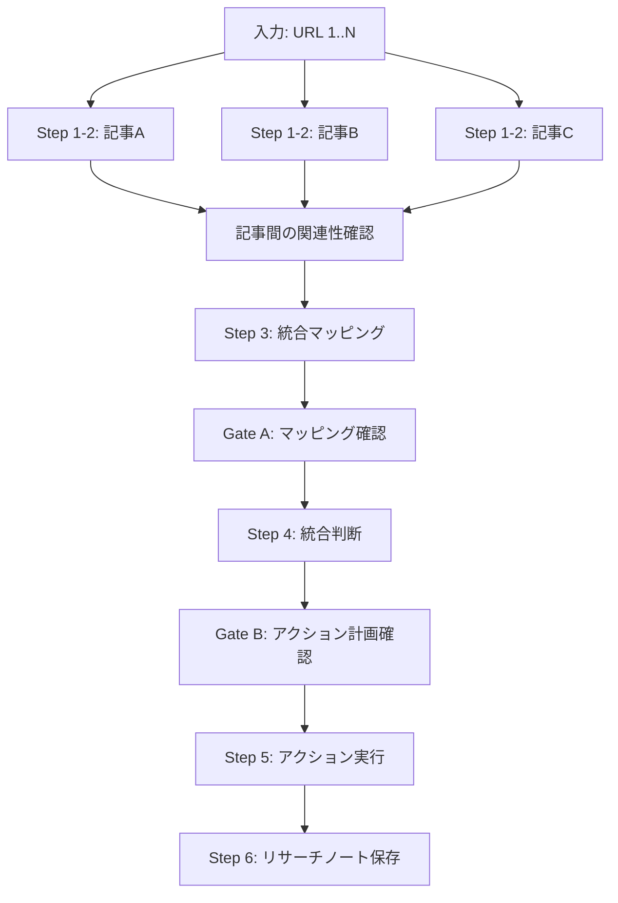

# Research Intake

外部記事 / 論文の URL を起点に、本質抽出 → 既存資産マッピング → 統合判断 → Issue化 / ドキュメント化を行う。

## 入力形式

- URL（1〜複数）: ブログ記事、論文、カンファレンス発表、ツイートスレッド等
- 分析観点（任意）: 「オーケストレーション観点で」「既存スキルへの流用観点で」等

入力例:
- `https://blog.fltech.dev/entry/2026/04/07/swebench`
- `https://caddi.tech/start-harness-engineering-with-framework` — 「ハーネスエンジニアリング観点で」

## 複数URL時の処理フロー

Step 1-2 は**記事ごと**に実行（並列可）、Step 3-4 は**統合**して処理する。



## Step 1: 記事の取得・読解

URL からコンテンツを取得し、記事の種別を判定する。URL 到達性を最初に確認する。

### 取得失敗時のフォールバック

URL が取得できない場合（X/Twitter の 403、ペイウォール等）:

1. WebSearch でキーワード検索し、キャッシュや引用サイト経由で内容を取得できるか試行
2. それでも取得できない場合は、ユーザーに本文の手貼りを依頼する
3. 本文が得られない URL は早期離脱する

### 種別判定

- ブログ記事 / 論文 → 本コマンドで続行
- OSS リポジトリ → `oss-research-session` スキルへハンドオフ（本コマンド終了）
- 混合（記事内で OSS を参照）→ 記事分析は本コマンド、OSS 深掘りは別途委譲

```
Read ~/.cursor/skills/oss-research-session/SKILL.md
```

### 出力形式（固定、記事ごとに1枚）

```markdown
### 記事情報
- **タイトル**: [title]
- **URL**: [url]
- **著者/組織**: [author]
- **公開日**: [date]
- **種別**: ブログ記事 / 論文 / カンファレンス発表 / ツイートスレッド
- **要約**: [3-5行]
```

## Step 2: 本質抽出

記事から再利用可能なパターン・原則・実装参照を構造化して抽出する。
「記事の要約」ではなく「自分の環境で再利用できる知識単位への変換」が目的。

### 出力形式（固定、記事ごとに1枚）

```markdown
### 本質的パターン

| # | パターン名 | 本質（1-2行） | 種別 |
|---|-----------|-------------|------|
| 1 | [name]    | [essence]   | 設計原則 / ワークフロー / 実装パターン / ツール / 評価手法 |
```

### 種別の定義

| 種別 | 対象 |
|------|------|
| **設計原則** | 責務分割、制約、トレードオフの判断基準 |
| **ワークフロー** | 手順の順序、フェーズ遷移、ゲートの設計 |
| **実装パターン** | コードレベルで再利用可能な構造（ライセンス確認必須） |
| **ツール** | CLIツール、ライブラリ、フレームワークの利用パターン |
| **評価手法** | 測定方法、ベンチマーク、品質基準 |

### 実装参照候補（該当する場合のみ）

実装パターンの種別に該当するもの、またはコードレベルで流用可能な要素がある場合に作成する。

```markdown
### 実装参照候補

| # | 対象 | リポジトリ/ファイル | ライセンス | 確認元 | 流用形態 |
|---|------|-------------------|-----------|--------|---------|
| 1 | [what] | [url/path] | MIT / Apache-2.0 / copyleft / unknown | [LICENSE ファイル or パッケージメタの URL] | そのまま利用 / 改変して取り込み / パターンのみ参照 |
```

ライセンスが `copyleft` または `unknown` の場合は Gate A でフラグを立て、ユーザーに互換性確認を求める。ライセンス確認は**実装参照候補がある場合のみ**実施する。

### 複数URL入力時

Step 2 完了後、記事間の関連性を確認する。同一テーマや同一資産に接続しそうなパターンがあれば、Step 3 で統合マッピングする際の入力として記録する。

## Step 3: 資産マッピング

抽出したパターンを既存資産と突き合わせる。複数記事の場合はここで統合して処理する。

### 前処理（コンテキスト収集）

1. `canonical/CATALOG.md` を全文読み込み（スキル/コマンド/エージェント/ルール一覧）
2. Step 2 で抽出したキーワードを使い、関連するオープン Issue を絞り込み取得:

```bash
gh issue list --state open --json number,title,labels --search "[キーワード]"
```

3. `docs/research/` と `docs/draft/` のファイル名一覧を取得し、タイトル/タグが一致するものだけ本文を読む（全件読み込みはしない）
4. `ideas/connections.md` を読み込み、抽出パターンに関連するアイデアがないか確認する。接続が見つかった場合は該当アイデアの本文も参照する（ideas/ は frozen snapshot のため更新対象にはしない）

### 出力形式（固定）— 2トラック

```markdown
### トラックA: 既存資産への接続

| パターン | 接続先 | 接続の性質 | ギャップ/新規知見 |
|---------|--------|-----------|-----------------|
| [pattern] | Issue #XX / skill: YY / docs/ZZ | 補強 / 修正 / 拡張 | [gap] |

### トラックB: 新規導入候補

| パターン | 既存対応物 | 導入形態 | 実現可能性メモ |
|---------|-----------|---------|-------------|
| [pattern] | なし | 新規スキル / 新規エージェント / 新規CLI / projects/ 候補 / ideas/ 記録 | [feasibility] |
```

## Gate A: マッピング結果の確認

- トラック A/B の結果をユーザーに提示
- 「このマッピングで合っているか」「追加の接続先はないか」を確認
- `copyleft` / `unknown` ライセンスの実装参照候補がある場合はここでフラグ表示
- ユーザーが承認した場合のみ Step 4 に進む

## Step 4: 統合判断

各パターンに対してアクション種別を判定する。

### アクション種別（7種）

| 種別 | 意味 | 出力先 |
|------|------|--------|
| `discard` | 有用性が低い、ノイズ | なし（理由を1行記録） |
| `archive-note` | 参考情報としてリサーチノートに記録（保存して終了） | `docs/research/` |
| `defer` | 今は判断できない / 追加情報が必要。再訪トリガーを設定 | `docs/research/` + `next_step` に再訪条件を明記 |
| `enrich-existing` | 既存 Issue / ドキュメントにコメント・更新 | 既存ファイル / `gh issue comment` |
| `create-issue` | 行動可能なタスクとして Issue 化 | `gh issue create` |
| `create-component` | 新規スキル / エージェント / CLI / プロジェクトの設計検討 | `ideas/YYYYMMDD/` or Issue |
| `experiment` | 小規模な検証を先に行う | `ideas/YYYYMMDD/` + 検証手順 |

`archive-note` と `defer` の区別: `archive-note` は「保存して完了」、`defer` は「後で再評価する意図がある」。`defer` 時はリサーチノートの `next_step` フィールドに再訪トリガー（日付 or 条件）を必ず記録する。

### 判定基準チェックリスト

各パターンに以下を順に適用する:

1. 既存 Issue に直接接続するか → `enrich-existing`
2. 行動に落ちる粒度があるか → `create-issue`
3. 既存環境に対応物が一切ないが有用か → `create-component` or `experiment`
4. 複数 Issue に跨る知見か → `archive-note`
5. 今は判断できない / 追加情報が必要か → `defer`
6. 面白いだけで行動に落ちないか → `discard`

## Gate B: アクション計画の確認

- Step 4 の判定結果（各パターンのアクション種別 + 具体的な実行内容）をユーザーに提示
- 特に `create-issue` / `create-component` / `enrich-existing` は外部影響があるため、実行内容を具体的に提示
- ユーザーが承認した場合のみ Step 5 に進む

## Step 5: アクション実行

Gate B で承認されたアクションのみ実行する。

- `enrich-existing`: 既存 Issue へのコメントまたはドキュメントへの Append（diff 提示 + 承認）
- `create-issue`: `issue-conventions` スキルに従って Issue 作成
- `create-component`: `ideas/YYYYMMDD/` に概念ノートを作成、または直接 Issue 化（ユーザー判断）
- `experiment`: 検証手順のドラフトを `ideas/YYYYMMDD/` に記録
- `defer`: リサーチノートに `next_step` 付きで記録（Step 6 で保存）

## Step 6: リサーチノート保存

`archive-note` / `defer` 判定されたもの、または全体の分析結果をリサーチノートとして保存する。

**保存先:** `docs/research/YYYY-MM-DD-<slug>.md`（既存パターン踏襲、kebab-case）

**フロントマター（既存リサーチノートのパターンに準拠）:**

```yaml
---
title: "[記事タイトルまたは分析テーマから生成]"
date: YYYY-MM-DD
status: research-complete
tags: [research-intake, ...]
sources:
  - [入力URL]
related_ideas:
  - [ideas/ との接続があれば記載]
next_step:
  trigger: "[再訪のきっかけ。日付 or 条件]"
  actions: "[再訪時に具体的に何をするか。接続先の資産に対してどう働きかけるか]"
  referenced_by: "[このノートが引かれる文脈。どの作業・Epic・プロジェクトからこのノートを参照するか]"
---
```

### next_step の書き方

research-intake でドキュメントが作られる時点で Gate A/B を通過しており、何らかの接続先が存在する。`next_step` は単なる再訪条件ではなく、**次のセッションでこのノートを渡すだけで AI が自律的に動ける**粒度を目指す。

- **trigger**: いつ・どういうきっかけで開くか。「フロントエンド開発タスクの実需発生時」「Issue #XX の着手時」等
- **actions**: 再訪時に具体的に何をするか。「ideas/YYYYMMDD の検証セクションにパターン N を適用した計画を作成」「既存スキル X に品質基準を試行追加」等。Step 3-4 の結果から導出する
- **referenced_by**: このノートがどの作業から参照されるか。Epic、プロジェクト、関連 Issue、他のリサーチノート等。**他の作業からの導線**を明示することで、能動的な再訪だけでなく、関連作業の中で自然に引かれる状態を作る

### リサーチノートに含める内容

リサーチノートは「後から振り返るとき元ソースを読み直さなくても文脈が分かる」ことを目的とする。以下の各ステップの出力を転記する。記述の深さは記事の内容量や具体例の量に応じて自然に決める。

1. **記事情報と要約**（Step 1 出力）: 各記事の情報カード。要約は元記事を再読しなくても内容が把握できる程度に
2. **本質的パターンと詳細**（Step 2 出力）: パターンテーブルに加え、各パターンの具体的内容（設計判断の根拠、実装例、適用条件等）。パターン名だけのラベルにせず、そのパターンが「なぜ有効か」「どう使うか」が伝わる粒度で記述する
3. **実装参照候補**（Step 2 出力、該当時）: ライセンス情報を含む
4. **資産マッピング結果**（Step 3 出力）: トラック A/B テーブル
5. **アクション判定**（Step 4 出力）: 各パターンのアクション種別と理由

## 安全規律

- Step 1-4 は read-only（情報取得・分析のみ）。Step 5 以降が変更系
- 既存ドキュメントの更新（`enrich-existing`）は diff 提示 + ユーザー承認
- Issue 作成（`create-issue` / `create-component`）は内容提示 + ユーザー承認
- Gate A / Gate B を省略して実行に進まない
- `copyleft` / `unknown` ライセンスの実装参照を直接取り込む場合はユーザーに互換性確認を求める
