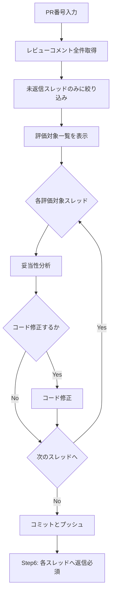

# Copilot Review Response

自分の PR に対する Copilot のレビュー行コメントを扱う。**評価対象は未返信のスレッドだけ**に絞り、対応ののち **必ず PR 上で返信**する（対応しなかった場合も理由必須）。

## エージェント向け必須要件

このコマンドを実行する AI エージェントは、次を **必ず守る**。「推奨」ではなく **必須／禁止**。

**用語**

- **PR 側（こちら）**: 返信を投稿する GitHub ユーザー。通常は `gh api user -q .login` の結果と一致する（別アカウントで返す場合はその `login` に読み替え）。

**評価対象**

- Copilot がつけたレビューコメントのうち、**当該スレッドに PR 側のコメントがまだ 1 件もない**ルートコメントに対応するスレッド**だけ**を評価する。
- **対象外**にしたコメント ID は、一覧を出すなら **`スキップ理由: 返信済`** を 1 行添えて省略を防ぐ。

**完了条件**

- フローは **Step 5（コミットとプッシュ）のあと、Step 6 で評価対象スレッドすべてに返信**する。
- 各評価対象スレッドについて **必ず** `gh api ... -X POST ... -F in_reply_to=<ルートコメントのID>` で PR に返信する。返信なしでタスクを終了してはならない。
- **コード変更で指摘に応えた場合**（対応した）: 本文は **過去形・事実**（「対応した」系）で書く。**実際に行った変更の要約** と **該当コミット ID**（短 SHA でよい。複数なら列挙するか、追える範囲を明示）を **必ず** 含める。diff と突き合わせられる粒度にする。補足は箇条書きでよい（中身は空にしない）。
- **コード変更なしで見送る場合**（対応しない）: **「今回は対応しません」**（または同義で明確な否定）と、**理由を箇条書き必須**（1 行でもよい。空にしない）。

**禁止事項**

- 未返信に絞らず、**全コメントを列挙しただけで再レビューだけ**をして終えること。
- 評価対象スレッドに対し、**返信せずに終える**こと。

## 入力形式

- `https://github.com/owner/repo/pull/123`
- `#123`
- `123`

## フロー



## 前提条件確認

```bash
if ! gh auth status &>/dev/null; then
  echo "GitHub CLI 未認証です"
  echo "設定方法: gh auth login"
  exit 1
fi
echo "GitHub CLI: 認証済み"

gh repo view --json nameWithOwner -q '.nameWithOwner' || {
  echo "GitHubリポジトリではありません"
  exit 1
}
```

## Step 1: レビューコメントの取得と未返信への絞り込み

### Step 1a: 全件取得

```bash
PR_NUM="<入力から抽出>"
REPO=$(gh repo view --json nameWithOwner -q '.nameWithOwner')
REPLY_LOGIN=$(gh api user -q .login)

gh api --paginate "repos/${REPO}/pulls/${PR_NUM}/comments" \
  -q '.'
```

### Step 1b: 未返信スレッド（Copilot ルートかつ PR 側の投稿なし）だけ列挙

**判定ルール**

- **スレッドのルート**: `in_reply_to_id` が `null` の行コメント。
- **Copilot**: `.user.login` に `copilot` を含む（大文字小文字は区別しない）。必要なら環境に合わせ allowlist 化する。
- **スレッドのメンバー**: ルートの `id` を起点に、`in_reply_to_id` がスレッド内のいずれかの `id` を指すコメントを繰り返し足し、届かなくなるまで辿る（ネスト返信も含む）。
- **評価対象**: ルートが Copilot かつ、スレッドメンバーの `.user.login` に **PR 側（`REPLY_LOGIN`）が 1 度も出現しない**もの。

**参考: 1 パイプで評価対象ルートだけ表示する例**

```bash
REPLY_LOGIN=$(gh api user -q .login)
gh api --paginate "repos/${REPO}/pulls/${PR_NUM}/comments" \
  | jq --arg me "$REPLY_LOGIN" '
def thread_ids($comments; $root_id):
  { acc: [$root_id], frontier: [$root_id] }
  | until(.frontier | length == 0;
      (.frontier) as $f
      | ($comments
        | map(select(.in_reply_to_id as $p | $p != null and ($f | index($p) != null)))
        | map(.id)) as $n
      | .acc += $n | .frontier = $n
    )
  | .acc;

  . as $comments
  | ($comments | map(select((.in_reply_to_id == null) and (.user.login | test("copilot"; "i"))))) as $roots
  | $roots[]
  | . as $root
  | thread_ids($comments; $root.id) as $tids
  | select(
      ($comments
        | map(select(.id as $i | ($tids | index($i) != null)))
        | map(.user.login)
        | index($me)) == null
    )
  | {id, path, line, body}
'
```

**注**: 「UI 上だけ解決済みにしたが PR 側の返信はまだない」は REST だけでは `isResolved` と一致しない。必要なら GitHub UI で確認するか、任意で GraphQL の `isResolved` を参照する（下記「GraphQL を併用する場合」）。

以下の形式で一覧表示する（評価対象のみ）:

| # | ID | ファイル | 行 | 指摘内容（要約） |
|---|-----|---------|-----|-----------------|
| 1 | 123 | path/to/file.php | 45 | 指摘の要約 |

## Step 2: 各スレッドの妥当性分析

**Step 1b で絞った各スレッド**について確認する:

- 技術的に正しい指摘か
- 対応すべき優先度（高/中/低/対応不要）
- 対応した場合の影響範囲

## Step 3: 対応方針決定

対応/非対応を一覧表示し、ユーザー確認:

| # | 指摘内容 | 対応 | 理由 |
|---|---------|------|------|
| 1 | バージョンチェックロジック | する | 正しい指摘 |
| 2 | ハードコードされたパス | しない | 動作上問題なし |

## Step 4: コード修正

Step 3 で対応すると決めた指摘についてコードを修正する。

## Step 5: コミット＆プッシュ

```bash
git add -A
git commit -m "fix: Copilotレビュー指摘対応"
git push

# コミットハッシュ取得（返信用。複数コミットなら列挙や範囲も明示すること）
COMMIT_HASH=$(git rev-parse --short HEAD)
echo "コミットハッシュ: $COMMIT_HASH"
```

## Step 6（必須）: 各評価対象スレッドに返信

Step 1b の**各ルートコメント ID**に対し、次を満たしてから `POST` する。

**返信前チェックリスト（各行コメントごと）**

- `in_reply_to` はそのスレッドの **ルート**の ID か（既存スレッドへの返信のため）
- **対応した**場合: 変更の要約と **コミット ID** が本文に含まれるか
- **対応しない**場合: 「今回は対応しません」相当と **理由** が本文に含まれるか

### 返信コマンド

```bash
REPO=$(gh repo view --json nameWithOwner -q '.nameWithOwner')
COMMENT_ID="<ルートコメントID>"

gh api repos/${REPO}/pulls/${PR_NUM}/comments \
  -X POST \
  -f body="返信内容" \
  -F in_reply_to=$COMMENT_ID
```

### 返信内容フォーマット（重要）

- **対応した場合**は「修正します」ではなく **既に実施した内容**と **追跡用コミット**を書く。
- 他のエンジニアも読むため、簡潔でも **要約とコミット**は欠かさない。

**対応した場合（例）:**

```
対応しました。

- 変更内容: メジャー・マイナーのみを使うよう `cut -d "." -f 1,2` を追加
- 対応コミット: 75371c8
```

**対応しない場合（例）:**

```
今回は対応しません。

- 理由: Remi 導入後は `/usr/bin/php81` が利用できるため
- 補足: alternatives はデフォルトの `/usr/bin/php` のみ切り替え対象で、バージョン固有バイナリには影響しない
```

## 安全規律

- 実行前に対象（org/repo、ブランチ、PR番号）を明記する
- コード修正は提案のみ、実行は承認後
- read-only（view/list）→ 変更系（edit/commit/push）の順で進める

## よく使うコマンド

```bash
# PR詳細
gh pr view $PR_NUM

# 全コメント取得
gh api --paginate "repos/${REPO}/pulls/${PR_NUM}/comments"

# 未返信の Copilot ルートのみ（Step 1b と同じ考え方）
# REPLY_LOGIN / jq は Step 1b 参照

# コメントに返信（ルート ID を in_reply_to に指定）
gh api repos/${REPO}/pulls/${PR_NUM}/comments \
  -X POST \
  -f body="返信" \
  -F in_reply_to=コメントID
```

## GraphQL を併用する場合の注意（実行する AI エージェント側）

**既定**: 評価対象の切り分けは **Step 1b（未返信・REST）** を主とする。**スレッドの resolve（解決済み）は API 必須にしない**。手元で UI から解決してよい（毎回 `resolveReviewThread` を叩かなくてよい）。

`isResolved` だけ取りたい・解決済みを機械的に除外したい場合に限り GraphQL（`gh api graphql`）を足す。使う場合の「コスト」は **GitHub の課金ではなく、エージェント側のコンテキストと手順の複雑さ**が主になる。

- **手順とプロンプトが重くなる**: クエリの組み立て、変数、`after` によるページング、失敗時の切り分けなど、エージェントが保持・実行する情報量が増える。
- **ツール出力が増える**: レスポンス JSON が大きくなり、読み取り・要約・対応表の生成に使うトークンが増えやすい。取得フィールドは必要最小限にし、ページングで分割する。
- **複数エージェントで同じ PR を回す場合**: 未返信に絞らないと、すでに返信済みのスレッドを再度「検討」し、**エージェントの無駄な推論・出力**が乗る。
- **人間が手元で `gh` を打つだけ**の運用では、上記のエージェント由来のコストはほぼ問題にならない。

**参考（自動化・高頻度スクリプトのみ）**: CI やボットが GitHub API を大量に叩く場合は、REST／GraphQL それぞれのレート制限が別枠になるなどの制約がある。[Rate limits and query limits for the GraphQL API](https://docs.github.com/en/graphql/overview/resource-limitations)
