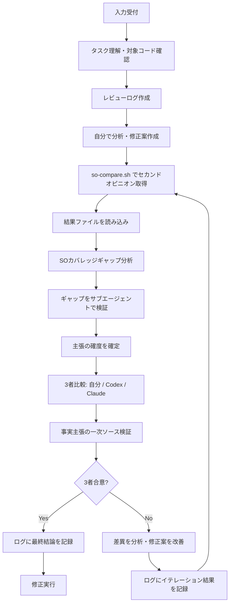

# Peer AI Review

修正タスクや設計判断に対して、Codex CLI と Claude Code にピアレビューを依頼し、自分の判断と比較する。
**3者（自分 / Codex / Claude）が合意に至るまでイテレーションを繰り返す。1回で終わらせる必要はない。**

## 入力形式

- タスクの説明（自然言語）
- 対象ファイルパスやエラー内容
- （任意）自分の分析結果や修正案

入力例:
- "Sentryで `utf8_encode` の非推奨エラーが出ている。`app/Services/Foo.php` の修正方針を検証したい"
- "このPRの変更が安全か確認したい #123"

## コア原則: 3者合意ループ

**修正実行は3者合意が成立してからのみ行う。** 合意に至らない場合は、差異を分析し、修正案を改善してセカンドオピニオンを再取得する。

- 1回のイテレーションで合意に至らなくてもよい
- 合意に至るまで Step 3〜4 を繰り返す
- 最大3イテレーションを目安とし、それでも合意しない場合は残存する差異を明示して判断を仰ぐ

**フォールバック**: `claude-safe` 未導入等で2者しか参加できない場合、「2者合意 + ユーザーの明示承認」で代替可。`--codex-only` / `--claude-only` 使用時はこのルールを適用する。

## フロー



## レビューログ

各レビューセッションの経緯をマークダウンファイルに記録する。イテレーションの判断過程を追跡可能にする目的。

### ログファイルの作成

Step 1（タスク理解）完了時点で、ログファイルを作成する。

```bash
# ログディレクトリ（so-compare.sh と同じ tmp/ 配下）
REVIEW_DIR="tmp/peer-review-$(date +%Y%m%d-%H%M%S)"
mkdir -p "$REVIEW_DIR"
```

ログファイル: `$REVIEW_DIR/review-log.md`

### ログテンプレート

```markdown
---
title: "Peer Review: [タスクの1行要約]"
date: YYYY-MM-DD
type: review-log
tags: [peer-review, so-compare]
---

# Peer Review Log

- **対象**: [タスクの1行要約]
- **対象ファイル**: `path/to/file`
- **状態**: 進行中 / 合意済み / 上限到達・判断待ち

## 自分の分析（Step 2）

- 問題: [問題の説明]
- 原因: [根本原因]
- 修正案: [具体的な修正内容]
- リスク: [修正に伴うリスク]

## カバレッジギャップ補完（Step 3.5）

### SOの検証スコープ

| 主張 | 分類 | 根拠 |
|------|------|------|
| [SOの主張] | 検証済み / 推測 / 未言及 | [SOが引用したコード片、または推測と判断した理由] |

### ギャップ検証結果

| 検証対象 | SO主張 | 実際の事実 | ステータス |
|---------|--------|-----------|-----------|
| [推測主張/未言及スコープ] | [SOの記述] | [サブエージェントが確認した事実] | ✅/❌/⚠️/🔍 |

### Step 4 に進む前の確認

- [ ] 推測主張がすべて検証された
- [ ] 未言及だが影響判断に必要なスコープが調査された
- [ ] 🔍 未検証の主張がある場合、合意判定でリスクとして扱う旨を明記した

## イテレーション 1

- **so-compare 出力**: `tmp/so-YYYYMMDD-HHMMSS/`

### 比較結果

| 観点 | 自分 | Codex | Claude | 合意? |
|------|------|-------|--------|-------|
| 問題認識 | ... | ... | ... | ✅/❌ |
| 修正方針 | ... | ... | ... | ✅/❌ |
| リスク対応 | ... | ... | ... | ✅/❌ |

### 事実検証

| 主張 | 主張者 | 検証方法 | 一次ソース | 結果 |
|------|--------|---------|-----------|------|
| [事実主張] | Codex/Claude/自分 | 公式ドキュメント/実コード実行/ソースコード確認 | [検証に使ったソース] | 確認済み/誤り/未検証 |

### 判定

- **結果**: 合意 / 不一致あり
- **不一致点**: [差異の要約]（不一致の場合）
- **次のアクション**: [修正案の改善内容 / Step 3 に戻る理由]

## イテレーション 2（必要な場合）

- **前回からの変更点**: [修正案・プロンプトの変更内容]
- **so-compare 出力**: `tmp/so-YYYYMMDD-HHMMSS/`

### 比較結果

（同上のテーブル形式）

### 判定

（同上）

## 最終結論

- **合意状態**: 3者合意 / 部分合意（残存差異あり） / 上限到達
- **採用方針**: [最終的に採用した修正方針の要約]
- **残存リスク**: [あれば記載]
- **合意に至った根拠**: [なぜこの方針で3者が納得したか]

## 教訓（修正実行後に記入）

### SO が発見し自分が見落としていたこと

- [見落とし内容] — 発見者: Codex/Claude

### SO が誤っていたこと

- [誤指摘内容] — 一次ソースによる反証: [ソース]

### 次回同種タスクへの申し送り

- [次回改善すべき点（プロンプト設計、コンテキスト添付、検証手順など）]
```

### ログの運用ルール

- 各 Step の完了時にログを更新する（まとめて書くのではなく随時追記）
- `so-compare.sh` の出力ディレクトリパスを必ず記録する（生データへのトレーサビリティ）
- 判定セクションは省略しない。合意でも不一致でも理由を書く
- **教訓セクションは修正実行の完了後に必ず記入する**。見落とし・SO 誤指摘・申し送りの3項目
- ログファイルは `tmp/` 配下なので gitignore 対象。YAML frontmatter 付きのため、エピソードドキュメントへの昇格はファイル移動のみで可能

## 前提条件確認

```bash
# Codex CLI
command -v codex &>/dev/null && echo "codex: $(codex --version 2>&1 | tail -1)" || echo "codex: 未インストール"

# Claude Code (claude-safe)
command -v claude-safe &>/dev/null && echo "claude-safe: OK" || echo "claude-safe: 未インストール（Codexのみで実行可能）"

# 比較スクリプト
command -v so-compare &>/dev/null && echo "so-compare: OK" || echo "so-compare: 未インストール（scripts/sync/sync-bin.sh を実行）"
```

## Step 1: タスク理解

入力からタスクの性質を把握する:

- **修正対象**: ファイルパス、関数名、エラー内容
- **修正の種類**: バグ修正 / 非推奨対応 / リファクタリング / 設計判断
- **影響範囲**: 変更が及ぶファイル・機能の範囲

対象コードを読み、現状を把握する。

**ログ**: このステップ完了時にレビューログファイルを作成し、ヘッダ部分（日時・対象・対象ファイル）を記入する。

## Step 2: 自分の分析

対象コードを分析し、修正案を作成する。この時点ではまだ修正を実行しない。

出力形式:

```
### 分析結果
- 問題: [問題の説明]
- 原因: [根本原因]
- 修正案: [具体的な修正内容]
- リスク: [修正に伴うリスク]
```

**ログ**: 分析結果をログの「自分の分析（Step 2）」セクションに記録する。

## Step 2.5: SO プロンプト構成

so-compare.sh に渡すプロンプトを構成する。SO の出力精度はこのプロンプトの品質に直接依存する。

### レビュータイプの特定

タスクの性質に応じて、SO に求める検証の焦点を決める:

| タイプ | いつ | SO に求めること | 検証フォーカス |
|--------|------|---------------|-------------|
| **計画レビュー** | プラン策定後、実行前 | 手順の漏れ、順序の誤り、前提条件の妥当性 | 「やるべきことが正しいか」 |
| **設計レビュー** | 設計判断時 | 選択肢の比較、トレードオフ、互換性、代替案 | 「やり方が正しいか」 |
| **実装レビュー** | コード変更後 | コードの安全性、既存動作への影響、エッジケース | 「やったことが正しいか」 |

### プロンプト品質チェック

構成したプロンプトが以下を満たしているか確認してから Step 3 に進む:

1. **具体的な検証対象**: 「レビューして」ではなく「X, Y, Z を検証して」と列挙されているか
2. **事実と仮定の分離**: 自分の分析の中で「確認済みの事実」と「未検証の仮定」を区別しているか。仮定を事実として渡すとアンカリングが起きる
3. **コンテキストの十分性**: SO がこのプロンプトだけで回答できるか。不足している情報（ファイル、バージョン、実行環境）はないか
4. **反証可能性**: SO が「違う」と言える余地があるか。結論を含むプロンプトは追認を誘発する

### 探索モードの判定

以下のいずれかに該当する場合、SO プロンプトに persistent-exploration スキルの行動制約テンプレートを自動注入し、結果を探索木形式で報告するよう指示する:

- 再現手順の確立が必要なタスク
- 「不可能」「原因不明」と結論づけられる可能性があるタスク
- Sentry/ログでイベントが発生しているが原因が不明なタスク

**注入時の追加指示**（SO プロンプト末尾に追記）:

```
## 行動制約
- 「不可能」「再現できない」と結論づける前に、最低3つの代替アプローチを試すこと
- Sentry/ログでイベントが発生している場合、発生ルートは必ず存在する。「不可能」は許容しない
- 試したアプローチと結果を構造化して報告すること（探索木形式）
- 未探索のアプローチが残っている場合、それを明示すること
```

探索モードが不要な場合（単純なコードレビュー、設計判断の検証等）はこのセクションをスキップする。

## Step 3: セカンドオピニオン取得（サブエージェント委譲）

SO の実行・結果読み込み・比較テーブル作成をサブエージェントに委譲し、メインコンテキストを節約する。

**サブエージェントに以下を指示する**（Task tool の shell subagent を使用）:

```
以下のタスクを実行してください:

1. まず SO スキルを読み込む:
   Read ~/.cursor/skills/so-compare/SKILL.md

2. スキルのプロンプト設計原則に従い、以下のプロンプトで so-compare.sh を実行:
   so-compare -w "$(pwd)" "[Step 2.5 で構成したプロンプト]"
   [イテレーション2回目以降は --prev オプションを追加]

3. 実行完了後、codex-stdout.txt と claude-stdout.txt を読み込む

4. 以下の形式で3者比較テーブルを作成し、合意判定を行う:
   - 自分の分析: [Step 2 の分析結果をここに記載]
   - 比較観点: 問題認識、修正方針、リスク対応
   - 合意判定基準: スキルの「合意判定基準」に従う

5. 以下の形式で結論サマリのみ返す:
   - so-compare 出力ディレクトリパス
   - 3者比較テーブル
   - 合意/不一致の判定と理由
   - 事実主張のリスト（検証が必要なもの）

注意: codex-stdout.txt / claude-stdout.txt の全文は返さないこと。要約と比較テーブルのみ。
```

**フォールバック**: サブエージェントが利用できない場合は、従来通り直接実行する:

```bash
so-compare -w "$(pwd)" "[プロンプト]"
```

**ログ**: サブエージェントが返した出力ディレクトリパスをログに記録する。

## Step 3.5: SOカバレッジギャップの補完

Step 3 でサブエージェントが返した結果を消費する前に、SO が実際に検証したスコープと検証していないスコープを分離し、ギャップをサブエージェントで埋める。

**このステップを省略して Step 4 に進まないこと。** SO の回答にはタイムアウト・コンテキスト制約により、実際にコードを読まず推測で語っている部分が混在する。それを未検証のまま比較テーブルに入れると、誤った前提で合意判定が進む。

### 3.5.1: SO の検証スコープを特定

Step 3 のサブエージェントが返した事実主張リストに対し、以下を分類する:

| 分類 | 判定基準 | 例 |
|------|---------|---|
| **検証済み主張** | SO が具体的なファイルパス・行番号・コード片を引用して根拠を示している | 「`app/Services/Foo.php` L42 で `utf8_encode()` を呼んでいる」 |
| **推測主張** | SO がコードを読んだ証拠なく、一般論・推測・「〜のはず」で語っている | 「呼び出しチェーンは Controller → Service → Repository の構造だと思われる」 |
| **未言及スコープ** | SO が触れていないが、修正の影響判断に必要なコードレイヤー | 呼び出し元、テストコード、設定ファイル、マイグレーション |

### 3.5.2: ギャップの検証（サブエージェント委譲）

「推測主張」と「未言及スコープ」を Explorer サブエージェントに委譲して検証する:

```
以下のコード調査を実行してください:

## 背景
[タスクの1行要約]
SO（セカンドオピニオン）が以下の主張をしていますが、実際にコードを読んで確認していません。

## 検証対象
1. [推測主張A]: SOは「〜のはず」と述べているが、実際のコードを確認していない
   → [該当ファイル/関数] を読んで事実を確認してください
2. [推測主張B]: ...
3. [未言及スコープC]: SOは [レイヤー名] について言及していないが、修正の影響判断に必要
   → [該当ファイル/関数] を読んで影響を確認してください

## 報告形式
各検証対象について:
- 事実: [コードを読んで確認した事実]
- SO主張との差異: [一致 / 不一致（具体的な差異）/ SOが言及していない新事実]
- 引用: [確認したファイルパスと該当行]
```

### 3.5.3: 主張の確度を確定

サブエージェントの検証結果を受けて、各主張にステータスを付与する:

| ステータス | 意味 |
|-----------|------|
| ✅ 確認済み | コード確認により事実と確認された |
| ❌ 誤り | コード確認により誤りと判明した（SOハルシネーション） |
| ⚠️ 部分的に正確 | 方向性は合っているが詳細が異なる |
| 🔍 未検証 | 検証手段がない、または検証コストが高すぎる |

**確度不明の主張が残った状態で Step 4 の合意判定に進まない。** `🔍 未検証` の主張がある場合は、合意判定時にその旨を明示し、未検証事項を前提としたリスクとして扱う。

**ログ**: カバレッジギャップ分析と検証結果をログの「カバレッジギャップ補完（Step 3.5）」セクションに記録する。

## Step 4: 3者比較と合意判定

サブエージェントが返した比較テーブルを確認する。サブエージェント利用時は比較テーブルが既に作成されているため、事実検証に集中する。

比較観点（サブエージェント未使用時に自分で作成する場合）:

| 観点 | 自分 | Codex | Claude |
|------|------|-------|--------|
| 問題認識 | | | |
| 修正方針 | | | |
| 見落としていたリスク | | | |
| 代替案の提示 | | | |

### 事実主張の一次ソース検証

比較テーブルを埋めた後、合意判定に入る **前に**、3者いずれかが行った事実主張（バージョン、API の存在、設定仕様、動作仕様など）を一次ソースで検証する。

- SO の事実主張は正確とは限らない（ハルシネーション、古い情報に基づく誤判断の実例あり）
- 何が一次ソースかはドメインに応じて判断する（公式ドキュメント、API レスポンス、ソースコード、実行結果など）
- 検証不能な主張は「未検証」としてログに明記し、合意判定で考慮する
- **SO が言ったから正しい、ではなく、一次ソースで確認できたから正しい**

**ログ**: 検証した事実主張と結果（確認済み / 誤り / 未検証）をログに記録する。

### 合意判定基準

以下の **すべて** を満たした場合に「3者合意」とする:

1. **問題認識が一致**: 3者が同じ問題を認識している
2. **修正方針の方向性が一致**: 具体的な実装は異なっても、アプローチの方向性が同じ
3. **重大なリスク指摘が未解決でない**: いずれかが指摘したリスクに対して、反論または対策が示されている

「方向性が一致」の目安:
- 同じファイル・同じ関数を修正対象としている
- 修正の手段（関数の置換 / ロジック変更 / 設定変更など）のカテゴリが同じ
- 片方が「修正不要」としている場合は不一致とみなす

### 合意に至らない場合（イテレーション）

差異がある場合、**修正実行に進まず**、以下を行う:

1. **差異の特定**: どの観点で不一致があるか明確化
2. **差異の原因分析**: コンテキスト不足 / 別の解釈 / 知識の差
3. **修正案の改善**: 差異を踏まえて自分の修正案を更新
4. **プロンプトの改善**: 不足していたコンテキストや制約条件を追加
5. **Step 3 に戻る**: 改善した修正案とプロンプトで SO を再実行（`--prev` で前回文脈引き継ぎ）

### SO が「不可能」「再現できない」と回答した場合

通常の不一致イテレーションではなく、**探索モードに切り替える**:

1. persistent-exploration スキル（`~/.cursor/skills/persistent-exploration/SKILL.md`）の突破口チェックリストを参照
2. チェックリストから未試行のアプローチを特定し、SO プロンプトに具体的に列挙して再実行
3. SO の結果を探索木形式で整理し、未探索ブランチが残っていれば継続

探索モードでも既存のイテレーション上限（最大3回）を適用する。3回で解決しない場合は、探索木の未探索ブランチを明示してユーザーに判断を委ねる。

イテレーション時の出力形式:

```
### イテレーション N（N=2,3,...）

#### 前回からの変更点
- [修正案の変更内容]
- [プロンプトに追加したコンテキスト]

#### 再比較結果
| 観点 | 自分 | Codex | Claude | 合意? |
|------|------|-------|--------|-------|
| 問題認識 | | | | ✅/❌ |
| 修正方針 | | | | ✅/❌ |
| リスク対応 | | | | ✅/❌ |
```

### イテレーション上限

- 目安: **最大3イテレーション**
- 3回繰り返しても合意に至らない場合:
  - 残存する差異を明示的にリストアップ
  - 各立場の論拠を整理
  - ユーザーに判断を委ねる（勝手に進めない）

**ログ**: 各イテレーションの比較結果・判定・次のアクションをログに記録する。合意判定の理由は省略しない。

## Step 5: 修正実行（3者合意後のみ）

**前提: Step 4 で3者合意が成立していること。合意なしに修正を実行しない。**

Step 4 の結論に基づき、修正を実行する。

- 修正は1コミット1論理変更で進める
- 変更前にテスト（既存テスト実行 or 手動確認）
- コミットメッセージに判断根拠を簡記
- コミットメッセージまたはPR本文に合意プロセスの要約を記載

**ログ**: 最終結論セクション（合意状態・採用方針・残存リスク・根拠）を記入し、状態を「合意済み」または「上限到達・判断待ち」に更新する。修正完了後、教訓セクション（見落とし・SO誤指摘・申し送り）を記入する。

## 安全規律

- Step 2（自分の分析）を必ず先に行う。セカンドオピニオンに引きずられない
- セカンドオピニオンの指摘は「参考情報」。最終判断は自分が行う
- **3者合意なしに修正を実行しない。差異がある場合はイテレーションを繰り返す**
- イテレーション上限（3回目安）を超えても合意しない場合は、ユーザーに判断を委ねる
- **バイアス補正**: 自分（Agent）は審判と選手を兼ねている。不一致がある場合は、自分の案を正当化しようとするバイアスに注意し、Codex/Claude の指摘を優先的に検討する
- `so-compare.sh` は read-only sandbox がデフォルト。書き込みは不要

## よく使うプロンプトパターン

```bash
# PHP非推奨関数の修正方針
"以下のPHPコードで非推奨関数 [関数名] が使われています。
PHP 8.x で推奨される代替手段と、後方互換性を保った修正案を提示してください。"

# コードレビュー（安全性観点）
"以下のコードをセキュリティの観点でレビューしてください。
入力検証、エスケープ、権限チェックの不足があれば指摘してください。"

# 設計判断の反証
"以下の設計判断について反証してください。
見落とし・破壊的変更のリスク・将来負債・代替案を指摘してください。"

# 修正案の検証
"以下の修正案は安全ですか？
既存の振る舞いを壊さないか、エッジケースの考慮漏れがないか検証してください。"
```
