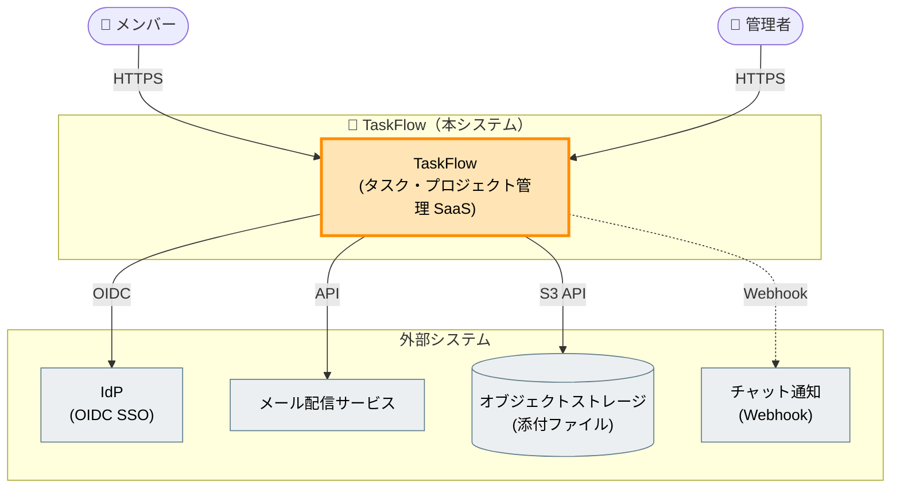
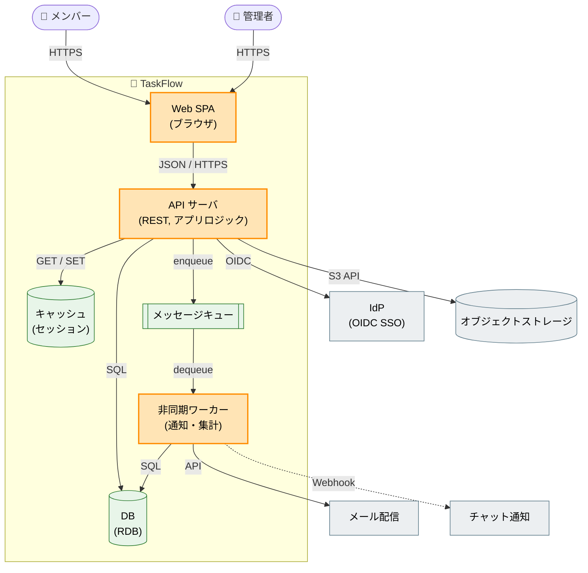
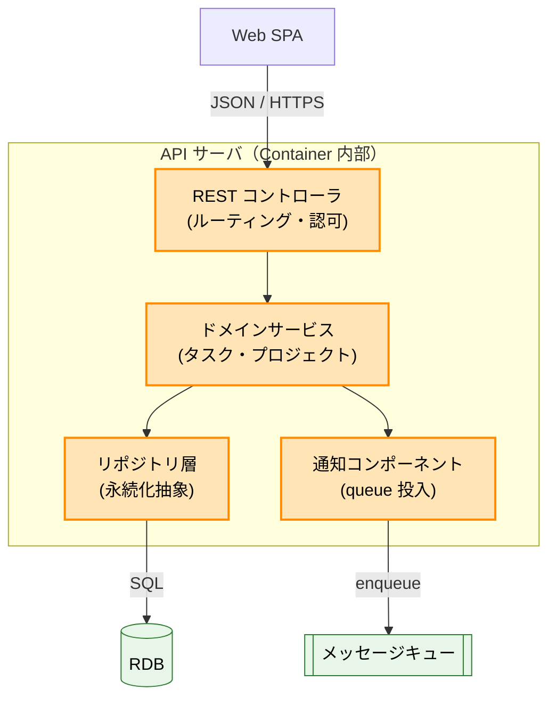
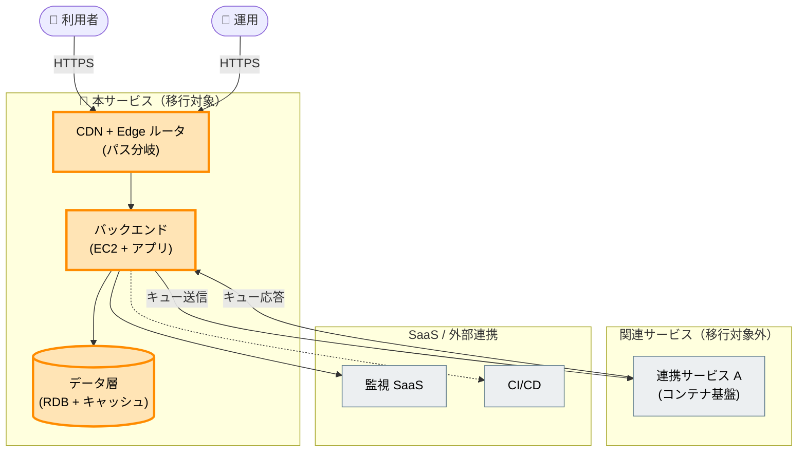
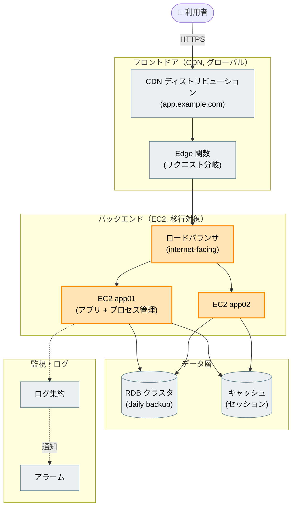
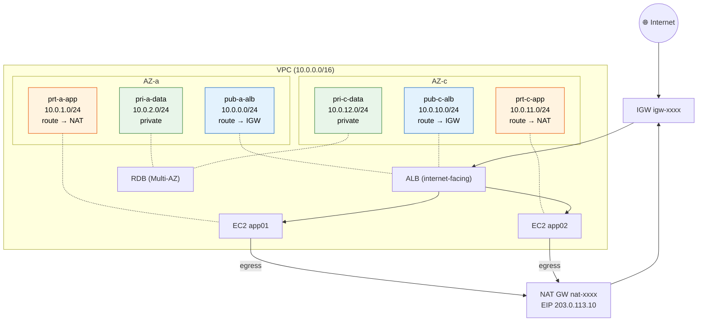
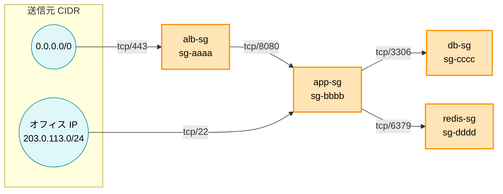

# C4 アーキテクチャ図化スキル

構造化データを **C4 アーキテクチャ図（Mermaid）** に変換するための記述スキル。アーキテクチャ設計フェーズで、人間と LLM の共通言語として使えるようにする。

C4 は notation-independent な**ソフトウェアアーキテクチャ記法**であり、インフラ専用ではない。アプリ・サービス・インフラ・設計議論の図示に汎用的に使える。インフラはあくまで適用ドメインの 1 つとして扱う。

## いつ使うか

- アーキテクチャ設計・議論の場で構造を図示したいとき
- System Context / Container / Component / Deployment のいずれかの視点で作図するとき
- AS-IS（現状）と TO-BE（移行後）を描き分けたいとき
- 棚卸し結果や設計メモを、人間と LLM が同じ認識を持てる図に落とすとき

## いつ使わないか

- データ収集そのもの（AWS read-only export / 手動棚卸し）— **収集レイヤー**であり本スキルの対象外
- 秘匿値スキャン（公開前 GATE）— **公開前ゲート**として別途扱う
- Markdown 記法そのもの（`markdown-conventions` が優先）

## スコープ

### 含む（変換レイヤーに限定）

- 構造化データ（インベントリ JSON / 設計メモ / 棚卸し結果）→ C4 Mermaid 図への変換
- C4 の 4 レベル視点（System Context / Container / Component / Deployment）
- `graph TD` + `classDef` 色凡例の規約（Notion 互換のため C4 拡張構文は使わない）
- AS-IS / TO-BE の描き分け、「移行対象 / 対象外」などの色区別パターン

### 含まない（別レイヤー）

- データ収集（AWS / 手動）— 収集レイヤー、スキル外
- 秘匿値スキャン GATE — 公開前ゲート、独立して扱う
- JSON 正本 → 派生レンダリングの機械処理 — 将来課題

## C4 の 4 レベル（汎用ビューとして）

C4 はズームレベルの異なる 4 種類のビューで構成される。対象がアプリでもインフラでも同じ枠組みが使える。

| Level | 描くもの（汎用） | 主な用途 |
|-------|----------------|---------|
| **L1 System Context** | システム全体 + 利用者 + 外部システムの関係 | 全体像の共有。クライアント説明、スコープ確認 |
| **L2 Container** | システム内の独立デプロイ単位（アプリ / サービス / DB / SPA / キュー等） | 各構成要素の責務と連携の理解 |
| **L3 Component** | 1 つの Container 内部のコンポーネント構成 | 変更影響範囲の把握。必要時のみ掘り下げ |
| **Deployment** | Container を実行基盤（インフラ）にマッピング | 物理配置・冗長構成の確認 |

補足:

- **Context + Container でほとんどの開発チームには十分**。Component / Deployment は価値がある時のみ描く（過剰な詳細化を避ける）
- **L4 Code**（クラス・コード詳細）は通常省略する
- **Dynamic ビュー**（番号付きリクエストフロー）も拡張として使える。複雑なワークフローの説明時のみ、エッジラベルを `1. ...` `2. ...` と番号付けして手順を示す
- **Network Topology / SG Topology などのインフラ図は標準 C4 レベルではない**。Deployment 系の「ドメイン拡張ビュー」として位置づける（後述のインフラ例を参照）

## 記法規約

### graph TD + classDef を使う（C4 拡張構文は使わない）

Mermaid には `C4Context` / `C4Container` 等の C4 専用構文があるが、**本スキルでは使わない**。

理由: **Notion 互換**。Notion は Mermaid の C4 拡張構文をレンダリングできない。`graph TD` + `classDef` なら GitHub / Cursor / Notion すべてで安定表示できる。C4 は「4 レベルの視点」として運用し、記法は汎用フローチャートに寄せる。

基本要素:

- グループ境界: `subgraph` でシステム / AZ / 層を囲む
- 関係: エッジにラベルを付ける（`-->|HTTPS|`、依存方向・プロトコルを明示）
- 色分け: `classDef` で「意味」を色に割り当て、`class` で適用

### ノード形状で種別を区別する

形状で種別を表すと視認性が上がる。

| 種別 | Mermaid 形状 | 例 |
|------|-------------|-----|
| アクター（人）| スタジアム `([...])` | `user(["👤 メンバー"])` |
| アプリ / サービス | 長方形 `[...]` | `api["API サーバ"]` |
| データストア（DB）| シリンダ `[(...)]` | `db[("RDB")]` |
| キュー / メッセージング | サブルーチン `[[...]]` | `queue[["キュー"]]` |

- **アクターをシリンダ `[(...)]` で描かない**（DB と紛らわしい。スタジアム `([...])` を使う）

### エッジの同期 / 非同期

- 実線 `-->` = 同期（要求応答）
- 破線 `-.->` = 非同期 / イベント / 任意・失敗許容
- 凡例がないと破線の意味は読み手に伝わらない

### 図を自己完結させる

図は単体で持ち出される（Notion 貼り付け、Issue 添付等）。図の先頭に `%% 凡例:` でエッジと色の意味を明記し、**図だけで意味が確定する**ようにする。

### レベル間の整合

- 上位レベル（Context）の外部依存は、下位レベル（Container）で「どの構成要素が担うか」まで落とす
- ラベル・色の意味・ノード名はレベルをまたいで一貫させる（往復理解テストで最も指摘されやすい点）

### 作図のベストプラクティス

- **各要素に Name / 種別 / 技術 / 役割を持たせる**（例: `api["API サーバ<br/>(REST, アプリロジック)"]`）。技術スタックが分かるとレビューしやすい
- **矢印は単方向を基本とする**。双方向 `<-->` は「どちらが起点か」が曖昧になるため、相互通信は 2 本の有向エッジに分ける
- **エッジラベルは動作 + 手段**で書く（`enqueue` / `SQL` / `Webhook で通知` 等。単なる「uses」は避ける）
- **1 図あたり ~20 要素まで**。超える場合は subgraph で分割するか、レベルを 1 段下げる

### 色凡例（推奨デフォルト・固定しない）

色凡例は**規約として固定しない**。ユースケース駆動で、形式を先に固めずケースごとに決める。以下は実証で有効だった**推奨例**。

| 意味（例） | classDef（例） |
|-----------|---------------|
| 移行対象 / 主題 | `fill:#FFE4B5,stroke:#FF8C00,stroke-width:3px,color:#000` |
| IaC 管理済 / 移行対象外 | `fill:#E3F2FD,stroke:#1565C0,color:#000` |
| 共有 / SaaS / 対象外 | `fill:#ECEFF1,stroke:#607D8B,color:#000` |
| データストア | `fill:#E8F5E9,stroke:#2E7D32,color:#000` |

### AS-IS / TO-BE の描き分け

- 同一図に併記（色で区別）するか、2 図を対比させる
- 「移行対象（AS-IS の主題）」と「移行後（TO-BE）」を色で区別する
- 移行系の入力には「移行対象 / 対象外」フラグを必ず含める

## 入力契約

本スキルの入力は **構造化データ**。最低限、次の情報が揃っていれば作図できる。

| 要素 | 必須 | 内容 |
|------|------|------|
| ノード | ✅ | id / 種別（アクター・アプリ・DB・外部等）/ ラベル |
| 関係 | ✅ | source / target / 種類（プロトコル・方向・同期/非同期）|
| グループ境界 | 任意 | subgraph 単位（システム / AZ / 層 / ドメイン）|
| 色分けの意味 | 任意 | 凡例（移行対象 / 対象外 等）|
| AS-IS / TO-BE フラグ | 移行系で必須 | 各ノードがどちらかの区別 |

収集手段（AWS export / 手動棚卸し）は**スキル外**。「どのレベルの図を描くか」を先に決め、そのレベルに必要な粒度の入力だけを受け取る。

## ワークド例

2 系統の例を示す。**例1 はアプリ（非インフラ）**、**例2 はインフラ**で、同じ記法規約が両ドメインに適用できることを示す。実務では同一システムを「論理（アプリ）」と「物理（インフラ / Deployment）」の両レベルで描き分ける。

### 例1: アプリ — TaskFlow（汎用 SaaS、非インフラ）

タスク・プロジェクト管理 SaaS を題材に、L1 → L2 → L3 をズームする。

#### L1 System Context



#### L2 Container

Context の外部依存（IdP / ストレージ / 通知）を、どの Container が担うかまで落とす。



#### L3 Component（API サーバの内部）



### 例2: インフラ — AWS 上の Web サービス（サニタイズ済み）

AWS 棚卸し結果を C4 で表現した応用例。**すべての値はダミー**（アカウント ID / IP / リソース ID は RFC5737・RFC1918 のドキュメント用値またはプレースホルダ）。実環境では実値に置換する。Network / SG は標準 C4 ではなく**インフラ拡張ビュー**。

#### System Context（インフラ視点）



#### Container（インフラ視点・AS-IS）



#### 拡張ビュー: Network Topology

標準 C4 レベルではなく、Deployment を補完するインフラ専用ビュー。サブネット配置とトラフィックフローを描く。



#### 拡張ビュー: Security Group Topology

SG 間の ingress 依存を有向グラフで描く。矢印は `source --(port)--> destination`（destination が source から ingress を受ける）。



## 公開時の注意（サニタイズ）

C4 図に実インフラ値（アカウント ID / 実 IP / リソース ID / 社内 CIDR）が含まれる場合、**公開リポジトリや外部共有に出す前に必ずサニタイズする**。秘匿値スキャン GATE 自体は本スキルの対象外（公開前ゲートとして別途扱う）だが、ダミー化の指針は次のとおり。

| 種別 | 置換例 |
|------|--------|
| アカウント ID | `000000000000` |
| ドメイン / ブランド | `app.example.com` / 汎用名 |
| リソース ID | `vpc-xxxx` / `sg-aaaa` 等のプレースホルダ |
| グローバル IP / 社内 CIDR | `203.0.113.0/24`（RFC5737）等のドキュメント用値 |
| プライベート CIDR | `10.0.0.0/16`（RFC1918）等の汎用値 |

## 検証パターン（往復理解テスト）

C4 の価値は「人間と LLM の共通言語」であること。図が一意に伝わるかを次の往復テストで検証できる。

1. 作図した Mermaid を `so-compare`（または `arena-compare`）に渡し、「**この図から構成・依存関係を再構成して**」と依頼する（結論を与えず、再構成させる）
2. 再構成結果を意図した構造と突合する
3. ズレた箇所 = 図の曖昧性。ラベル / 凡例 / エッジ方向を補強し、入力契約にフィードバックする

このスキルの例自体、上記テストで「破線の凡例不足・アクター形状の紛らわしさ・レベル間の外部依存の欠落」が指摘され、それを反映して改善した。図を作ったら必ず往復テストにかけるとよい。

## 参考実装と設計上の分岐

既存の C4 スキルを参考にしつつ、canonical の制約に合わせて記法を選び直した。

- [softaworks/agent-toolkit](https://github.com/softaworks/agent-toolkit/blob/main/skills/c4-architecture/README.md)（Mermaid C4 ネイティブ構文）— 作図のベストプラクティス（要素属性・単方向矢印・要素数上限・レベル要否・Dynamic ビュー）を流用。ただし記法は **Notion 互換のため C4 ネイティブ構文（`C4Context` 等）を使わず `graph TD` + `classDef`** にした
- [bitsmuggler/c4-skill](https://github.com/bitsmuggler/c4-skill)（Structurizr DSL）— レンダリングが重く、収集（コードベース解析）まで含むため**不採用**。本スキルは変換レイヤーに限定する

## 既存スキルとの関係

- **`markdown-conventions`**: Mermaid コードブロックは言語指定（` ```mermaid `）必須、箇条書きはハイフン。本スキルの出力も準拠する
- **`spec-card`**: 設計ドキュメント（kickoff / decision 等）に C4 図を埋め込む際は spec-card のフォーマットに従う
- **`so-compare` / `arena-compare`**: 上記「往復理解テスト」で図の曖昧性を検証する手段として利用する

本スキルはこれらを置き換えない。「構造化データ → C4 Mermaid 図」の変換規約に特化する。
