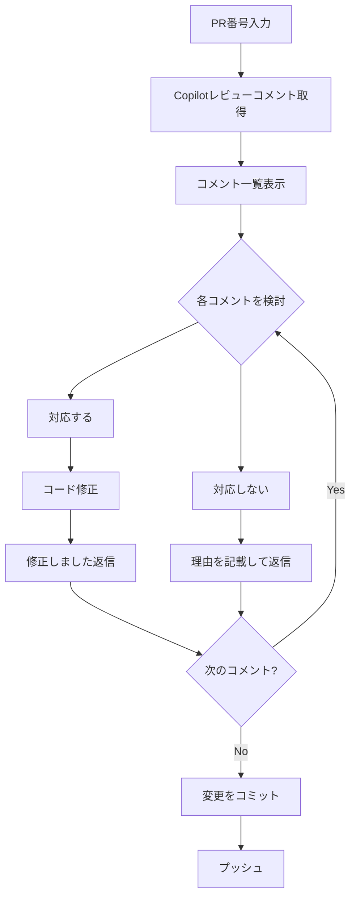

# Copilot Review Response

自分のPRに対するCopilotのレビューコメントを取得し、対応可否を検討、修正、返信まで行う。

## 入力形式

- `https://github.com/owner/repo/pull/123`
- `#123`
- `123`

## フロー



## 前提条件確認

```bash
if ! gh auth status &>/dev/null; then
  echo "GitHub CLI 未認証です"
  echo "設定方法: gh auth login"
  exit 1
fi
echo "GitHub CLI: 認証済み"

gh repo view --json nameWithOwner -q '.nameWithOwner' || {
  echo "GitHubリポジトリではありません"
  exit 1
}
```

## Step 1: Copilotコメント一覧取得

```bash
PR_NUM="<入力から抽出>"
REPO=$(gh repo view --json nameWithOwner -q '.nameWithOwner')

# Copilotのレビューコメント取得
gh api repos/${REPO}/pulls/${PR_NUM}/comments \
  --jq '.[] | select(.user.login | contains("copilot")) | {id, path, line, body}'
```

以下の形式で一覧表示:

| # | ID | ファイル | 行 | 指摘内容（要約） |
|---|-----|---------|-----|-----------------|
| 1 | 123 | path/to/file.php | 45 | 指摘の要約 |

## Step 2: 各コメントの妥当性分析

各コメントについて以下を確認:

- 技術的に正しい指摘か
- 対応すべき優先度（高/中/低/対応不要）
- 対応した場合の影響範囲

## Step 3: 対応方針決定

対応/非対応を一覧表示し、ユーザー確認:

| # | 指摘内容 | 対応 | 理由 |
|---|---------|------|------|
| 1 | バージョンチェックロジック | する | 正しい指摘 |
| 2 | ハードコードされたパス | しない | 動作上問題なし |

## Step 4: コード修正

対応するコメントについて、コードを修正。

## Step 5: コミット＆プッシュ

```bash
git add -A
git commit -m "fix: Copilotレビュー指摘対応"
git push

# コミットハッシュ取得（返信用）
COMMIT_HASH=$(git rev-parse --short HEAD)
echo "コミットハッシュ: $COMMIT_HASH"
```

## Step 6: 各コメントに返信

### 返信コマンド

```bash
REPO=$(gh repo view --json nameWithOwner -q '.nameWithOwner')
COMMENT_ID="<対象コメントID>"

gh api repos/${REPO}/pulls/${PR_NUM}/comments \
  -X POST \
  -f body="返信内容" \
  -F in_reply_to=$COMMENT_ID
```

### 返信内容フォーマット（重要）

他のエンジニアもコメントを見るため、詳細な返信を行う。

**対応する場合:**

```
修正しました。

- 変更内容: `cut -d '.' -f 1,2` を追加してメジャー・マイナーバージョンのみを抽出
- 対応コミット: 75371c8
```

**対応しない場合:**

```
今回は対応しません。

- 理由: Remiリポジトリからインストール後は `/usr/bin/php81` が利用可能なため
- 補足: alternativesはデフォルトの `/usr/bin/php` を切り替えるだけで、バージョン固有のバイナリには影響しない
```

## 安全規律

- 実行前に対象（org/repo、ブランチ、PR番号）を明記する
- コード修正は提案のみ、実行は承認後
- read-only（view/list）→ 変更系（edit/commit/push）の順で進める

## よく使うコマンド

```bash
# PR詳細
gh pr view $PR_NUM

# 全コメント取得
gh api repos/${REPO}/pulls/${PR_NUM}/comments

# 特定ユーザーのコメントのみ
gh api repos/${REPO}/pulls/${PR_NUM}/comments \
  --jq '.[] | select(.user.login == "copilot[bot]")'

# コメントに返信
gh api repos/${REPO}/pulls/${PR_NUM}/comments \
  -X POST \
  -f body="返信" \
  -F in_reply_to=コメントID
```
