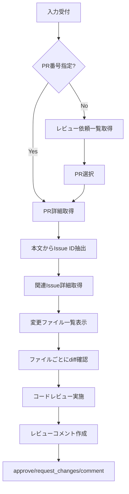

# PR Review

指定したPR（または自分にレビュー依頼が来ているPR）を一緒にレビューする。

## 入力形式

- `https://github.com/owner/repo/pull/123`
- `#123`
- `123`
- （入力なしの場合）自分にレビュー依頼が来ているPR一覧を表示

## フロー



## 前提条件確認

```bash
if ! gh auth status &>/dev/null; then
  echo "GitHub CLI 未認証です"
  echo "設定方法: gh auth login"
  exit 1
fi
echo "GitHub CLI: 認証済み"

gh repo view --json nameWithOwner -q '.nameWithOwner' || {
  echo "GitHubリポジトリではありません"
  exit 1
}
```

## Step 1: PR情報取得

### PR番号が指定されている場合

```bash
PR_NUM="<入力から抽出>"
# 他リポジトリの場合は REPO="owner/repo" を設定

# 現在のリポジトリのPR
gh pr view $PR_NUM --json number,title,body,files,additions,deletions,author,baseRefName,headRefName
gh pr view $PR_NUM

# 他リポジトリのPR（--repo オプションを付与）
gh pr view $PR_NUM --repo $REPO --json number,title,body,files,additions,deletions,author,baseRefName,headRefName
gh pr view $PR_NUM --repo $REPO
```

### PR番号が指定されていない場合（レビュー依頼一覧）

```bash
# 全リポジトリ横断でレビュー依頼を検索
gh search prs --review-requested=@me --state=open --json repository,number,title,author,url
```

一覧から対象PRを選択してもらい、`$PR_NUM` と `$REPO`（owner/repo形式）を設定。
以降のコマンドでは `--repo $REPO` オプションを付与する。

## Step 2: 関連Issue取得

PR本文から `#123` 形式のIssue IDを抽出し、Issue詳細を取得する。

```bash
# PR本文からIssue ID抽出（Refs #123, Closes #123, #123 などのパターン）
ISSUE_NUM=$(gh pr view $PR_NUM --json body --jq '.body' | grep -oE '#[0-9]+' | head -1 | tr -d '#')

# 関連Issue詳細取得
if [ -n "$ISSUE_NUM" ]; then
  gh issue view $ISSUE_NUM --json number,title,body,labels
  gh issue view $ISSUE_NUM
fi
```

以下の形式で要約:

- **Issue**: #[number] [title]
- **ラベル**: [labels]
- **内容サマリ**: [bodyの要約]

## Step 3: 変更概要の把握

```bash
gh pr view $PR_NUM --json files,additions,deletions --jq '{files: .files | length, additions: .additions, deletions: .deletions}'
gh pr view $PR_NUM --json files --jq '.files[].path'
```

以下の形式で要約:

- **変更ファイル数**: [files]
- **追加行数**: +[additions]
- **削除行数**: -[deletions]
- **変更ファイル一覧**: 各ファイルパス

## Step 4: diff確認

```bash
# 全体diff
gh pr diff $PR_NUM

# 特定ファイルのdiff
gh pr diff $PR_NUM -- path/to/file.php
```

ファイルごとに順次確認し、以下の観点でレビュー:

- コードの正確性・ロジックの妥当性
- エッジケースの考慮
- セキュリティ上の問題
- パフォーマンスへの影響
- 既存コードとの一貫性
- テストの有無・妥当性

## Step 5: レビュー結果の投稿

```bash
# 承認
gh pr review $PR_NUM --approve --body "LGTM"

# 修正依頼
gh pr review $PR_NUM --request-changes --body "修正依頼内容"

# コメントのみ
gh pr review $PR_NUM --comment --body "コメント内容"
```

## 安全規律

- 実行前に対象（org/repo、ブランチ、PR番号）を明記する
- 破壊的操作（merge/close/delete等）は「コマンド提示＋影響説明」で停止
- 明示指示がある場合のみ実行
- read-only（view/diff）→ 変更系（review/comment）の順で進める

## よく使うコマンド

```bash
# レビュー依頼一覧（全リポジトリ横断）
gh search prs --review-requested=@me --state=open --json repository,number,title,author,url

# レビュー依頼一覧（現在のリポジトリのみ）
gh pr list --search "review-requested:@me" --json number,title,author,url

# 自分が作成したPR一覧（現在のリポジトリのみ）
gh pr list --author "@me" --json number,title,state,url

# 自分が作成したPR一覧（全リポジトリ横断）
gh search prs --author=@me --state=open --json repository,number,title,url

# PR詳細
gh pr view $PR_NUM

# PRのdiff
gh pr diff $PR_NUM

# PRにコメント
gh pr comment $PR_NUM --body "コメント内容"

# PRのチェック状況
gh pr checks $PR_NUM
```
