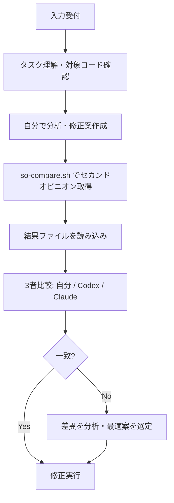

# Peer AI Review

修正タスクや設計判断に対して、Codex CLI と Claude Code にピアレビューを依頼し、自分の判断と比較する。

## 入力形式

- タスクの説明（自然言語）
- 対象ファイルパスやエラー内容
- （任意）自分の分析結果や修正案

入力例:
- "Sentryで `utf8_encode` の非推奨エラーが出ている。`app/Services/Foo.php` の修正方針を検証したい"
- "このPRの変更が安全か確認したい #123"

## フロー



## 前提条件確認

```bash
# Codex CLI
command -v codex &>/dev/null && echo "codex: $(codex --version 2>&1 | tail -1)" || echo "codex: 未インストール"

# Claude Code (claude-safe)
command -v claude-safe &>/dev/null && echo "claude-safe: OK" || echo "claude-safe: 未インストール（Codexのみで実行可能）"

# 比較スクリプト
SO_SCRIPT="$HOME/work/repos/github.com/stlwolf/ai-development-hub/scripts/so-compare.sh"
[[ -x "$SO_SCRIPT" ]] && echo "so-compare.sh: OK" || echo "so-compare.sh: 未配置"
```

## Step 1: タスク理解

入力からタスクの性質を把握する:

- **修正対象**: ファイルパス、関数名、エラー内容
- **修正の種類**: バグ修正 / 非推奨対応 / リファクタリング / 設計判断
- **影響範囲**: 変更が及ぶファイル・機能の範囲

対象コードを読み、現状を把握する。

## Step 2: 自分の分析

対象コードを分析し、修正案を作成する。この時点ではまだ修正を実行しない。

出力形式:

```
### 分析結果
- 問題: [問題の説明]
- 原因: [根本原因]
- 修正案: [具体的な修正内容]
- リスク: [修正に伴うリスク]
```

## Step 3: セカンドオピニオン取得

`so-compare.sh` を使って Codex / Claude に同じ質問を投げる。

```bash
# 基本形: プロンプトを直接渡す
$HOME/work/repos/github.com/stlwolf/ai-development-hub/scripts/so-compare.sh \
  "以下のコードについて、[問題の説明]。修正方針を提案してください。" \
  -c path/to/target-file.php

# コンテキスト付き: 複数ファイルを添付
$HOME/work/repos/github.com/stlwolf/ai-development-hub/scripts/so-compare.sh \
  "この修正案は安全か検証してください: [修正案の要約]" \
  -c path/to/file1.php path/to/file2.php

# Codex のみ（claude-safe が使えない環境）
$HOME/work/repos/github.com/stlwolf/ai-development-hub/scripts/so-compare.sh \
  "プロンプト" --codex-only

# 出力ディレクトリ指定
$HOME/work/repos/github.com/stlwolf/ai-development-hub/scripts/so-compare.sh \
  "プロンプト" -o tmp/so-current-task
```

実行後、結果ファイルを確認:

```bash
# 結果一覧
ls tmp/so-*/

# Codex の回答
cat tmp/so-*/codex-stdout.txt

# Claude の回答
cat tmp/so-*/claude-stdout.txt
```

## Step 4: 3者比較

自分の分析（Step 2）と、Codex / Claude の回答を比較する。

比較観点:

| 観点 | 自分 | Codex | Claude |
|------|------|-------|--------|
| 問題認識 | | | |
| 修正方針 | | | |
| 見落としていたリスク | | | |
| 代替案の提示 | | | |

**差異がある場合:**
- なぜ差異が生じたか（コンテキスト不足? 別の解釈?）
- どちらが正確か（コードを読んで検証）
- 採用する方針とその理由

## Step 5: 修正実行

Step 4 の結論に基づき、修正を実行する。

- 修正は1コミット1論理変更で進める
- 変更前にテスト（既存テスト実行 or 手動確認）
- コミットメッセージに判断根拠を簡記

## 安全規律

- Step 2（自分の分析）を必ず先に行う。セカンドオピニオンに引きずられない
- セカンドオピニオンの指摘は「参考情報」。最終判断は自分が行う
- 3者が一致しない場合、コードを読んで自分で検証する
- `so-compare.sh` は read-only sandbox がデフォルト。書き込みは不要

## よく使うプロンプトパターン

```bash
# PHP非推奨関数の修正方針
"以下のPHPコードで非推奨関数 [関数名] が使われています。
PHP 8.x で推奨される代替手段と、後方互換性を保った修正案を提示してください。"

# コードレビュー（安全性観点）
"以下のコードをセキュリティの観点でレビューしてください。
入力検証、エスケープ、権限チェックの不足があれば指摘してください。"

# 設計判断の反証
"以下の設計判断について反証してください。
見落とし・破壊的変更のリスク・将来負債・代替案を指摘してください。"

# 修正案の検証
"以下の修正案は安全ですか？
既存の振る舞いを壊さないか、エッジケースの考慮漏れがないか検証してください。"
```
