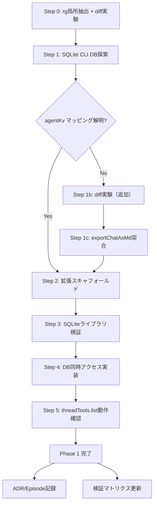

# Phase 1: DB読み取り基盤 — 具体的実装プラン

> peer-ai-review（実装プラン版）で3者合意済み。10項目の改善を反映。
> レビューログ: `projects/cursor-thread-tools/tmp/peer-review-20260220-210954/review-log.md`

## 前提

- キックオフドキュメント: `[docs/plans/2026-02-20-kickoff-phase1-db-foundation.md](projects/cursor-thread-tools/docs/plans/2026-02-20-kickoff-phase1-db-foundation.md)`
- peer-ai-review（キックオフ版）3者合意済み: `[tmp/peer-review-20260220-201106/review-log.md](projects/cursor-thread-tools/tmp/peer-review-20260220-201106/review-log.md)`
- peer-ai-review（実装プラン版）3者合意済み: `[tmp/peer-review-20260220-210954/review-log.md](projects/cursor-thread-tools/tmp/peer-review-20260220-210954/review-log.md)`
- 検証マトリクス: `[docs/VERIFICATION_MATRIX.md](projects/cursor-thread-tools/docs/VERIFICATION_MATRIX.md)`（A-1-1〜A-1-5 が対象）
- 作業ディレクトリ: `projects/cursor-thread-tools/extension/`

---

## Step 0: rg 局所抽出 + diff 実験によるマッピング特定

**目的**: `agentKv:blob` のキー生成パターンと `bubbleId` からのマッピング経路を特定する

> **peer-review 反映**: "逆アセンブル精読" → "rg 局所抽出 + diff 実験" に再定義。minified JS の全面精読は非効率（Codex/Claude 指摘）

**作業内容**:

### 0-a. rg でキーワード局所抽出

```bash
FILE="/Applications/Cursor.app/Contents/Resources/app/out/vs/workbench/workbench.desktop.main.js"

# 各キーワードの周辺200文字を抽出
rg -o '.{200}getConversationFromBubble.{200}' "$FILE"
rg -o '.{100}agentKv.{100}' "$FILE" | head -20
rg -o '.{100}cursorDiskKV.{100}' "$FILE" | head -20
rg -o '.{100}composer\.content.{100}' "$FILE" | head -20
```

確認すべきポイント:

- `agentKv:blob:<hash>` のキー生成ロジック（ハッシュアルゴリズム? UUIDベース?）
- `composer.content.*` が仲介者として使われているか
- `bubbleId` エントリから `agentKv:blob` への参照方法

### 0-b. diff 実験（rg で不十分な場合、または並行実施）

```bash
# 追加前のキー一覧を保存
sqlite3 "file:$HOME/Library/Application Support/Cursor/User/globalStorage/state.vscdb?mode=ro" \
  "SELECT key FROM cursorDiskKV ORDER BY key" > /tmp/keys-before.txt

# Cursorでメッセージを1つ送信

# 追加後のキー一覧
sqlite3 "file:$HOME/Library/Application Support/Cursor/User/globalStorage/state.vscdb?mode=ro" \
  "SELECT key FROM cursorDiskKV ORDER BY key" > /tmp/keys-after.txt

# 差分
diff /tmp/keys-before.txt /tmp/keys-after.txt
```

**成果物**: `agentKv:blob` マッピングの解明結果（episodes に記録予定）

**判断基準**: マッピングが解明できれば Step 1b はスキップ可能

---

## Step 1: SQLite CLI でDB構造を探索

**目的**: Step 0 の知見を実データで裏付ける

> **peer-review 反映**: `typeof(value)` で圧縮/バイナリ混在の可能性も確認（Codex 指摘）

**作業内容**:

1. DB を read-only で開き、以下のクエリを順次実行:

```sql
-- journal_mode 確認
PRAGMA journal_mode;

-- composerData のJSON構造（1件サンプル）+ 型確認
SELECT key, typeof(value), length(value), substr(value, 1, 500) FROM cursorDiskKV
WHERE key LIKE 'composerData:%' LIMIT 1;

-- bubbleId のJSON構造 + 型確認
SELECT key, typeof(value), length(value), substr(value, 1, 500) FROM cursorDiskKV
WHERE key LIKE 'bubbleId:%' LIMIT 1;

-- composer.content.* の構造（マッピング仲介者候補）
SELECT key, typeof(value), length(value), substr(value, 1, 500) FROM cursorDiskKV
WHERE key LIKE 'composer.content%' LIMIT 3;

-- agentKv:blob のサンプル（型・サイズ・先頭バイト）
SELECT key, typeof(value), length(value), hex(substr(value, 1, 16)) FROM cursorDiskKV
WHERE key LIKE 'agentKv:blob:%' LIMIT 3;

-- bubbleId 内のhash参照検索
SELECT key, value FROM cursorDiskKV
WHERE key LIKE 'bubbleId:%' AND value LIKE '%agentKv%' LIMIT 1;
SELECT key, value FROM cursorDiskKV
WHERE key LIKE 'bubbleId:%' AND value LIKE '%blob%' LIMIT 1;
SELECT key, value FROM cursorDiskKV
WHERE key LIKE 'bubbleId:%' AND value LIKE '%content%' LIMIT 1;
```

1. globalStorage vs workspaceStorage の確認:

```bash
find ~/Library/Application\ Support/Cursor -name "state.vscdb" -type f
```

**成果物**: 各キープレフィックスのJSON構造ドキュメント、マッピング経路の確認

---

## Step 1b: diff実験（Step 0/1 で解明不十分な場合のみ）

**条件**: `agentKv:blob` マッピングが Step 0+1 で判明しない場合に実施

- メッセージ送信前後のキー一覧 diff
- 増加したキーの集合からマッピングパターンを推定

---

## Step 1c: exportChatAsMd 出力との突合

- Cursorの Export Transcript で出力した MD ファイル（ゴールデン）と、自前抽出結果を比較
- 同値性を確認し、データ取得パスの正しさを裏付ける

---

## Step 2: 最小 VS Code 拡張スキャフォールディング

**目的**: Phase 1 成功基準「コマンドパレットから `threadTools.list` を実行できる」の骨格

> **peer-review 反映**:
>
> - `better-sqlite3` を `dependencies` に移動（`devDependencies` は VSIX に含まれない — 3者合意の致命的バグ修正）
> - `.vscode/launch.json` をスキャフォールドに追加（Claude 指摘）
> - Phase 1 は `tsc` のみ（バンドリングなし）。esbuild は Phase 4 で導入（3者合意）

**ディレクトリ構成**:

```
extension/
├── package.json          # name, publisher, engines, activationEvents, contributes.commands
├── tsconfig.json         # strict, ES2020, node module resolution
├── .vscodeignore         # node_modules, src/*.ts, etc.
├── .vscode/
│   └── launch.json       # Extension Development Host 起動設定
└── src/
    ├── extension.ts      # activate: コマンド登録、deactivate: 一時ファイルクリーンアップ
    ├── db/
    │   └── reader.ts     # state.vscdb 読み取り（DBパス解決、open/close）
    └── commands/
        └── list.ts       # threadTools.list 実装
```

`**package.json` の要点**:

```json
{
  "name": "cursor-thread-tools",
  "displayName": "Cursor Thread Tools",
  "publisher": "stlwolf",
  "engines": { "vscode": "^1.85.0" },
  "activationEvents": ["onCommand:threadTools.list"],
  "main": "./out/extension.js",
  "contributes": {
    "commands": [
      { "command": "threadTools.list", "title": "Thread Tools: List Threads" }
    ]
  },
  "scripts": {
    "compile": "tsc -p ./",
    "watch": "tsc -watch -p ./"
  },
  "dependencies": {
    "better-sqlite3": "^11.0.0"
  },
  "devDependencies": {
    "typescript": "^5.0.0",
    "@types/vscode": "^1.85.0",
    "@types/node": "^20.0.0",
    "@types/better-sqlite3": "^7.0.0"
  }
}
```

`**src/extension.ts` の設計**:

- `activate()`: コマンド登録。disposable を `context.subscriptions` に push
- `deactivate()`: 一時ファイル（DB コピー）のクリーンアップ

`**src/db/reader.ts` の設計**:

- DBパス解決: `vscode.env.appName` で Cursor/Code を判別（要ランタイム検証）。フォールバックとして `~/Library/Application Support/Cursor/User/globalStorage/state.vscdb`（macOS固定、Phase 1スコープ）
- open: `{ readonly: true, fileMustExist: true }` + `busy_timeout = 3000`
- journal_mode 事前確認（設定変更はしない、読み取りのみ）
- フォールバック: WAL 3ファイルコピー（db + `-wal` + `-shm`）。ユニークファイル名で衝突回避
- catch 範囲: `SQLITE_BUSY`/`SQLITE_LOCKED` のみコピーフォールバック。その他はユーザーにエラー表示
- close: `db.close()` を確実に呼ぶ（`try/finally`）

`**src/commands/list.ts` の設計**:

- `composerData:*` を全取得
- JSON parse → name, createdAt, bubbleCount を抽出。parse 失敗はスキップ（ログ出力最小化）
- QuickPick UI で一覧表示（`vscode.window.showQuickPick`）
- `detail` フィールドにメッセージ数・作成日時を表示（Phase 2 TreeView 移行時の仕様検討に有用）
- ソート: createdAt 降順（最新が上）

`**.vscode/launch.json`**:

```json
{
  "version": "0.2.0",
  "configurations": [
    {
      "name": "Run Extension",
      "type": "extensionHost",
      "request": "launch",
      "args": ["--extensionDevelopmentPath=${workspaceFolder}"],
      "outFiles": ["${workspaceFolder}/out/**/*.js"],
      "preLaunchTask": "${defaultBuildTask}"
    }
  ]
}
```

---

## Step 3: SQLiteライブラリ動作検証

> **peer-review 反映**: テストファースト方針を明確化。N-API prebuild がそのまま動くか先に確認（Codex/Claude 指摘）

**優先順位**（3者合意済み）:

1. `better-sqlite3`（ネイティブ N-API、同期API）
2. `vscode-node-sqlite3`（Microsoft fork、Node-API prebuilt）
3. いずれも不可時は機能停止（sql.js は本番経路に置かない）

**検証手順**:

1. Cursor の Electron/Node バージョンを確認:

```bash
/Applications/Cursor.app/Contents/MacOS/Cursor --version
```

拡張の `activate()` 内で詳細確認:

```typescript
console.log(process.versions); // electron, node, modules (ABI)
```

1. `extension/` で `npm install` → `npm run compile` → Extension Development Host で起動
2. `reader.ts` から `state.vscdb` を開いて `SELECT 1 FROM cursorDiskKV LIMIT 1` が通るか確認
3. N-API prebuild で動作すれば OK。失敗時:
  - エラーメッセージから ABI 互換性問題か判断
  - `vscode-node-sqlite3` に切り替えてリトライ

**成果物**: SQLiteライブラリ選定 ADR（`decisions/ADR-001-sqlite-library.md`）

---

## Step 4: DB同時アクセス戦略の実装

> **peer-review 反映**:
>
> - catch 範囲を `SQLITE_BUSY`/`SQLITE_LOCKED` に限定（Claude 指摘）
> - WAL 3ファイルコピー方式（db + `-wal` + `-shm`）（3者合意。`VACUUM INTO` は readonly 接続で使えないため棄却 — SQLite Forum で確認済み）
> - ユニークファイル名で衝突回避（Codex 指摘）
> - `deactivate()` で一時ファイルクリーンアップ（Claude 指摘）

**実装**（`src/db/reader.ts` 内）:

```typescript
import Database from 'better-sqlite3';
import { existsSync, copyFileSync, unlinkSync } from 'fs';
import { tmpdir } from 'os';
import { join } from 'path';

let tmpDbPath: string | null = null;

function openDatabase(dbPath: string): Database.Database {
  try {
    const db = new Database(dbPath, { readonly: true, fileMustExist: true });
    db.pragma('busy_timeout = 3000');
    const journalMode = db.pragma('journal_mode', { simple: true });
    db.prepare('SELECT 1 FROM cursorDiskKV LIMIT 1').get();
    return db;
  } catch (err: unknown) {
    if (!isBusyOrLocked(err)) {
      throw err;
    }
    return openWithCopyFallback(dbPath);
  }
}

function isBusyOrLocked(err: unknown): boolean {
  if (err instanceof Error) {
    return err.message.includes('SQLITE_BUSY') || err.message.includes('SQLITE_LOCKED');
  }
  return false;
}

function openWithCopyFallback(dbPath: string): Database.Database {
  const uniqueId = Date.now().toString(36);
  tmpDbPath = join(tmpdir(), `cursor-thread-tools-${uniqueId}.vscdb`);
  copyFileSync(dbPath, tmpDbPath);

  const walPath = dbPath + '-wal';
  const shmPath = dbPath + '-shm';
  if (existsSync(walPath)) copyFileSync(walPath, tmpDbPath + '-wal');
  if (existsSync(shmPath)) copyFileSync(shmPath, tmpDbPath + '-shm');

  return new Database(tmpDbPath, { readonly: true, fileMustExist: true });
}

export function cleanupTmpDb(): void {
  if (tmpDbPath) {
    for (const suffix of ['', '-wal', '-shm']) {
      const p = tmpDbPath + suffix;
      if (existsSync(p)) {
        try { unlinkSync(p); } catch { /* best effort */ }
      }
    }
    tmpDbPath = null;
  }
}
```

**検証**: Cursor でスレッド操作中に `threadTools.list` を実行し、ロック競合が発生しないことを確認

---

## Step 5: `threadTools.list` の動作確認

**成功基準チェックリスト**:

- コマンドパレットから `threadTools.list` を実行できる
- スレッド一覧（名前、メッセージ数、作成日時）が表示される
- `composerData` → `bubbleId` → アシスタント応答テキストのフルパスが判明している
- SQLiteライブラリが Cursor 内蔵 Electron で動作している

**検証マトリクス更新**:


| ID    | 対応Step     | 期待する状態更新        |
| ----- | ---------- | --------------- |
| A-1-1 | Step 3     | 未検証 → 有効/条件付き有効 |
| A-1-2 | Step 4     | 未検証 → 有効/条件付き有効 |
| A-1-3 | Step 1 + 5 | 部分検証 → 有効       |
| A-1-4 | Step 1 + 5 | 部分検証 → 有効       |
| A-1-5 | Step 0 + 1 | 未検証 → 有効        |


---

## 実行順序とブロッキング依存




---

## peer-ai-review 実施ポイント

Phase 1 実装中に以下のタイミングで `/peer-ai-review` を実施:

1. **Step 0完了時**: `agentKv:blob` マッピングのアプローチ確定
2. **Step 3完了時**: SQLiteライブラリ選定の最終判断（ADR作成前）
3. **Step 5完了時**: 拡張全体のアーキテクチャレビュー（Phase 2 キックオフ前）

---

## peer-ai-review（実装プラン版）で反映した改善点


| #   | 改善内容                                        | 指摘者          | 反映先                         |
| --- | ------------------------------------------- | ------------ | --------------------------- |
| 1   | `better-sqlite3` を `dependencies` に移動       | 3者共通         | Step 2 package.json         |
| 2   | WAL 3ファイルコピー（db + wal + shm）                | 3者共通         | Step 4 openWithCopyFallback |
| 3   | Step 0 を "rg局所抽出 + diff実験" に再定義             | Codex/Claude | Step 0 全体                   |
| 4   | Phase 1 は `tsc` のみ（バンドリングなし）                | Codex/Claude | Step 2 scripts              |
| 5   | catch 範囲を `SQLITE_BUSY`/`SQLITE_LOCKED` に限定 | Claude       | Step 4 isBusyOrLocked       |
| 6   | `.vscode/launch.json` をスキャフォールドに追加          | Claude       | Step 2 ディレクトリ構成             |
| 7   | `deactivate()` で一時ファイルクリーンアップ               | Claude       | Step 4 cleanupTmpDb         |
| 8   | QuickPick の `detail` フィールド活用                | Claude       | Step 2 list.ts 設計           |
| 9   | `vscode.env.appName` でアプリ判別を検討              | Claude       | Step 2 reader.ts 設計         |
| 10  | `VACUUM INTO` を棄却（readonly で使えない）           | 事実検証         | Step 4 コメント                 |


---

## 成果物一覧


| 成果物               | 配置先                                        | 内容                         |
| ----------------- | ------------------------------------------ | -------------------------- |
| 最小拡張コード           | `extension/`                               | `threadTools.list` が動作する拡張 |
| agentKv:blob 解明結果 | `docs/episodes/`                           | マッピング経路の記録                 |
| SQLiteライブラリ ADR   | `docs/decisions/ADR-001-sqlite-library.md` | 選定理由・検証結果                  |
| 検証マトリクス更新         | `docs/VERIFICATION_MATRIX.md`              | A-1-1〜A-1-5 の状態更新          |
| Phase 2 キックオフ情報   | `docs/plans/`                              | Phase 2 に必要な知見の整理          |


