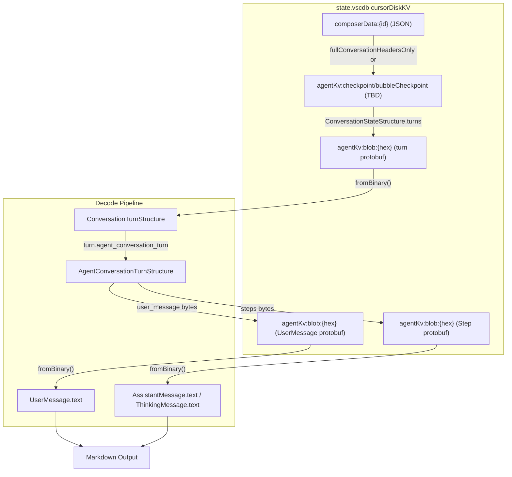
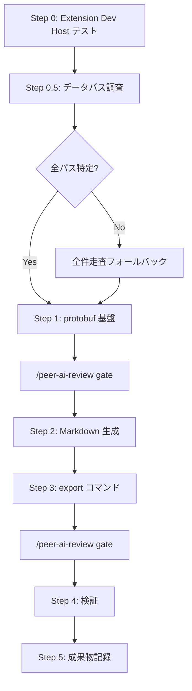

# Phase 2: Markdown エクスポート — 具体的実装プラン

> peer-ai-review（実装プラン版）で3者合意済み。
> レビューログ: `tmp/peer-review-20260221-131924/review-log.md`
> SO出力: `tmp/so-phase2-plan-review/`

## 前提

- キックオフドキュメント: `docs/plans/2026-02-20-kickoff-phase2-markdown-export.md`
- peer-ai-review 3者合意済み: `tmp/peer-review-20260221-131924/review-log.md`
- 検証マトリクス: `docs/VERIFICATION_MATRIX.md`（A-2-1〜A-2-4 が対象）
- 作業ディレクトリ: `projects/cursor-thread-tools/extension/`
- Phase 1 成果物: ADR-001（better-sqlite3）、`threadTools.list` 動作確認済み

## 判明済み protobuf メッセージ構造（agent.v1）

Cursor の `workbench.desktop.main.js` 逆引きで復元:

- `ConversationTurnStructure`: field 1 `agent_conversation_turn` (oneof), field 2 `shell_conversation_turn` (oneof)
- `AgentConversationTurnStructure`: field 1 `user_message` (bytes=blob ID), field 2 `steps` (repeated bytes), field 3 `request_id` (string?)
- `UserMessage`: field 1 `text` (string), field 2 `message_id` (string), field 4 `mode` (enum)
- `AssistantMessage`: field 1 `text` (string)
- `ThinkingMessage`: field 1 `text` (string), field 2 `duration_ms` (uint32)
- `ConversationStep`: field 1 `assistant_message` (oneof), field 2 `tool_call` (oneof), field 3 `thinking_message` (oneof)
- `ConversationStateStructure`: field 8 `turns` (repeated bytes), field 2 `turns_old` (repeated bytes)



## 設計判断（3者合意）

- **protobuf**: `@bufbuild/protobuf` runtime API (`makeMessageType()`) を adapter 層に隔離。version pin + golden test fixtures 必須
- **フォーマット判定**: 先頭バイトではなく `JSON.parse` 試行 → protobuf decode 試行 → 構造バリデーション
- **thinking_message**: 既定除外。`<details>` セクションでオプション出力（SpecStory 突合時は含める）
- **暗号化**: preflight で先頭バイト分布を確認。暗号化なしデータを先に対象。不可なら明示エラー
- **EncryptedBlobStore 鍵取得不能時**: スコープ縮小（暗号化なしのみ）+ ユーザーへの明示通知

---

## Step 0: Extension Development Host テスト（ブロッカー）

**目的**: better-sqlite3 が Cursor の Electron 環境でロードされるか確認。ここが壊れると Phase 2 全体が止まる。

**作業内容**:

```bash
cd extension/
npm install && npm run compile
```

- F5 → Extension Development Host 起動
- コマンドパレットから `threadTools.list` 実行 → QuickPick 表示を確認
- `process.versions` のコンソール出力を確認（Electron / Node バージョン）

**判断分岐**: 失敗 → `vscode-node-sqlite3` に切り替え（ADR-001 を supersedes で更新）

**合格基準**: QuickPick にスレッド一覧が表示される

---

## Step 0.5: データパス調査（3者合意で追加）

**目的**: Step 1 の前提となる実データ調査。**これが外れると全体が止まる**。

**作業内容**:

### 0.5-a. agentKv キー分類

```sql
SELECT
  CASE
    WHEN key LIKE 'agentKv:blob:%' THEN 'blob'
    WHEN key LIKE 'agentKv:checkpoint:%' THEN 'checkpoint'
    WHEN key LIKE 'agentKv:bubbleCheckpoint:%' THEN 'bubbleCheckpoint'
    ELSE 'other'
  END as type,
  count(*) as cnt
FROM cursorDiskKV WHERE key LIKE 'agentKv:%'
GROUP BY type ORDER BY cnt DESC;
```

### 0.5-b. agentKv:blob 先頭バイト分布（暗号化率の判定）

```sql
SELECT hex(substr(value, 1, 1)) as first_byte, count(*) as cnt
FROM cursorDiskKV WHERE key LIKE 'agentKv:blob:%'
GROUP BY first_byte ORDER BY cnt DESC;
```

- `7B` (JSON) / `0A` (protobuf) 以外の割合が多ければ暗号化が支配的

### 0.5-c. bubbleId テーブルサンプリング

```sql
SELECT key, substr(value, 1, 500) FROM cursorDiskKV
WHERE key LIKE 'bubbleId:%' LIMIT 1;
```

テキスト直格納の有無を確認。

### 0.5-d. ConversationStateStructure 取得パス特定

- `agentKv:checkpoint:` / `agentKv:bubbleCheckpoint:` の実データ先頭バイト確認
- 1スレッドを end-to-end で手動トレース: composerData → turn blob → user_message blob → text

**合格基準**: ConversationState → turn blob ID → テキストの完全パスが特定されている

---

## Step 1: protobuf デシリアライズ基盤

### 1-a. 依存追加 + adapter 層

`@bufbuild/protobuf` を `dependencies` に追加（version pin）。
メッセージ型定義は `extension/src/proto/agent.ts` に隔離:

```typescript
// adapter 層: このファイルのみが @bufbuild/protobuf に依存
// Cursor アップデートで壊れた場合、ここだけ修正すればよい
export const ConversationTurnStructure = makeMessageType(...)
export const UserMessage = makeMessageType(...)
// ...
```

> **注**: Step 0.5 の調査結果次第で raw protobuf parsing に切り替える可能性あり（Claude 提案のフォールバック）

### 1-b. blob デコーダー

`extension/src/blob/decoder.ts` — フォーマット判定 + デシリアライズ:

```typescript
function decodeBlobSafe(data: Buffer): DecodedBlob | null {
  // 1. JSON.parse 試行
  // 2. protobuf decode 試行 + 構造バリデーション（必須 field 存在チェック）
  // 3. 両方失敗 → null（unknown / encrypted）
}
```

### 1-c. DB reader 拡張

`extension/src/db/reader.ts` に blob 読み取り関数追加:

```typescript
export function getBlobByKey(db: Database, key: string): Buffer | null
export function getTurnBlobIds(db: Database, composerId: string): Buffer[]
```

### 1-d. golden test fixtures

代表的な blob データ（JSON / protobuf / unknown）をファイルに保存し、デシリアライズの regression test に使用。

**合格基準**: 1スレッドの全 turn のユーザーテキスト + アシスタントテキストが取得できる

---

## /peer-ai-review gate: Step 1 完了時

protobuf デシリアライズのアプローチ + 実装の3者レビュー。

---

## Step 2: Markdown 生成モジュール

`extension/src/export/markdown.ts`:

```typescript
interface ExportedTurn {
  type: 'human' | 'assistant';
  text: string;
  thinkingText?: string; // opt-in で <details> 出力
}
function generateMarkdown(
  threadName: string,
  turns: ExportedTurn[],
  options?: { includeThinking?: boolean }
): string
```

出力フォーマット:

```markdown
# {thread_name}
_Exported on {date} from Cursor Thread Tools_

---

**User**

{user_message}

---

**Assistant**

{assistant_response}

---
```

thinking は `<details><summary>Thinking</summary>...</details>` で折りたたみ（オプション）。

---

## Step 3: threadTools.export コマンド

- `extension/src/commands/export.ts` 新規作成
- `extension/src/extension.ts` にコマンド登録追加
- `extension/package.json` の `contributes.commands` に追加

フロー: QuickPick 選択 → preflight（暗号化チェック）→ turn デコード → Markdown 生成 → `.thread-exports/{composerId}.md` 保存 → エディタで開く

---

## /peer-ai-review gate: Step 3 完了時

拡張全体のコードレビュー（Phase 3 キックオフ前）。

---

## Step 4: 検証

- A-2-1: SpecStory 出力と突合（thinking 含む版で比較）
- A-2-2: 情報過不足の確認
- A-2-3: 400+ bubbles スレッドの処理時間計測（目標: 5秒以内）
- A-2-4: コマンドパレットからの E2E テスト

---

## Step 5: 成果物記録

- エピソード: `episodes/2026-02-21-phase2-markdown-export.md`
- VERIFICATION_MATRIX A-2-1〜A-2-4 更新
- ADR 追加（protobuf アプローチが ADR 相当の判断なら）
- Phase 3 キックオフ情報整理

---

## 実行順序とブロッキング依存



---

## ファイル構成（新規・変更）

```
extension/
  package.json            # 変更: protobuf依存追加, threadTools.export コマンド
  src/
    extension.ts          # 変更: export コマンド登録
    commands/
      list.ts             # 変更なし
      export.ts           # 新規
    proto/
      agent.ts            # 新規: adapter 層（protobuf メッセージ型定義）
    blob/
      decoder.ts          # 新規: フォーマット判定 + デシリアライズ
    export/
      markdown.ts         # 新規: Markdown 生成
    db/
      reader.ts           # 変更: blob 読み取り関数追加
  test/
    fixtures/             # 新規: golden test データ
```

---

## リスクと対処

- **better-sqlite3 Electron ロード失敗**: Step 0 で最優先確認。失敗時は vscode-node-sqlite3 にフォールバック
- **ConversationState 取得パス不明**: Step 0.5 で実データ調査。最悪 agentKv:blob 全件走査
- **暗号化が全 blob に適用**: Step 0.5 preflight で判明。明示エラーでスコープ縮小を通知
- **@bufbuild/protobuf バージョン互換**: adapter 層隔離 + version pin。壊れたら protobufjs にフォールバック
- **protobuf スキーマ変更**: golden test で検出。unknown field は安全にスキップ

---

## peer-ai-review で反映した改善点

| # | 改善内容 | 指摘者 | 反映先 |
|---|---------|--------|--------|
| 1 | Step 0.5（データパス調査）をブロッカーとして追加 | Codex/Claude | Step 0.5 全体 |
| 2 | フォーマット判定を先頭バイトから try/catch + 構造検証に変更 | Codex/Claude | Step 1-b |
| 3 | ConversationState 取得パスの実データ検証を必須化 | Codex/Claude | Step 0.5-d |
| 4 | 暗号化率 preflight クエリを追加 | Claude | Step 0.5-b |
| 5 | thinking_message の方針を Step 2 前に決定 | Codex/Claude | 設計判断セクション |
| 6 | protobuf を adapter 層に隔離 + version pin + golden test | Codex | Step 1-a |
| 7 | bubbleId テキスト直格納の可能性を調査に追加 | Claude | Step 0.5-c |

---

## 成果物一覧

| 成果物 | 配置先 | 内容 |
|--------|--------|------|
| protobuf デコーダー | `extension/src/proto/` | adapter 層 or raw パーサー |
| blob デコーダー | `extension/src/blob/` | フォーマット判定 + デシリアライズ |
| Markdown 生成 | `extension/src/export/` | 会話テキスト → MD 変換 |
| export コマンド | `extension/src/commands/` | threadTools.export |
| DB reader 拡張 | `extension/src/db/` | blob 読み取り関数追加 |
| エピソード | `docs/episodes/` | Phase 2 作業記録 |
| 検証マトリクス | `docs/VERIFICATION_MATRIX.md` | A-2-1〜A-2-4 更新 |
