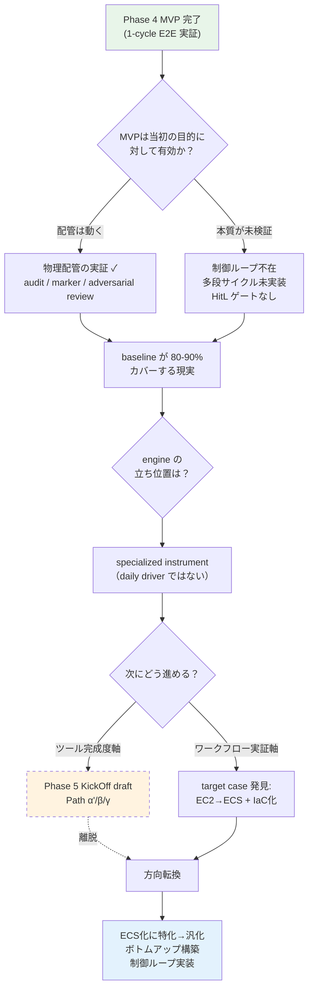
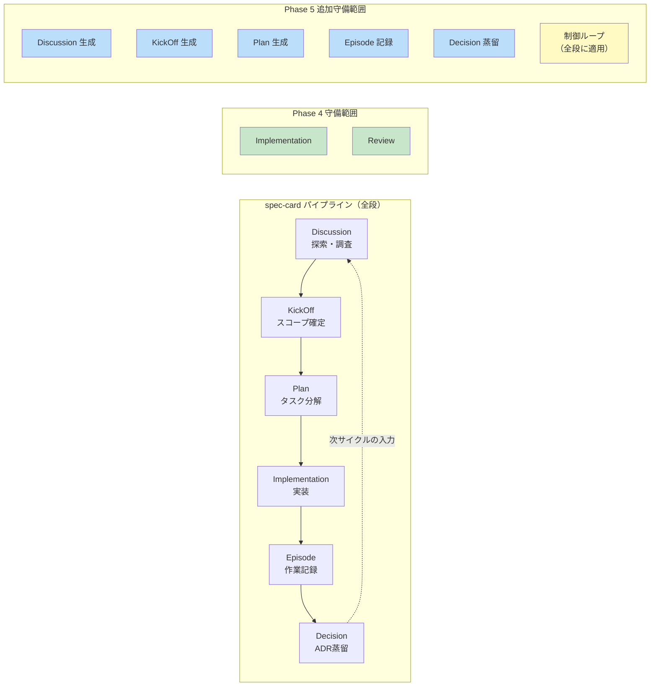
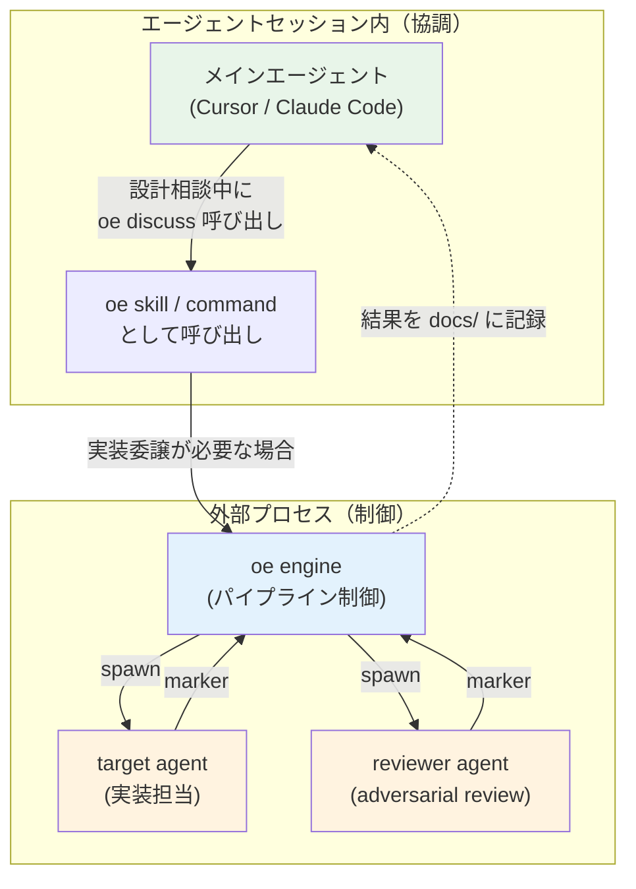
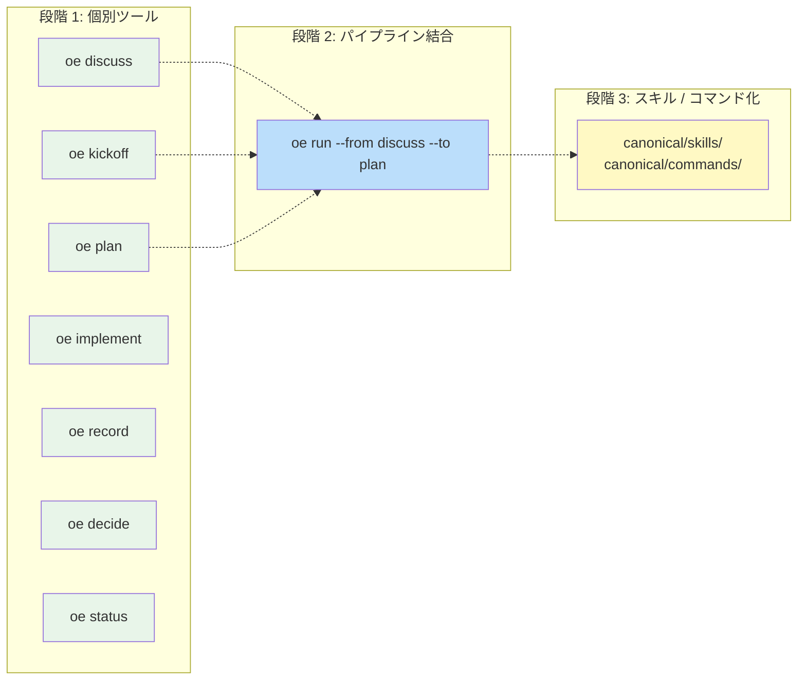
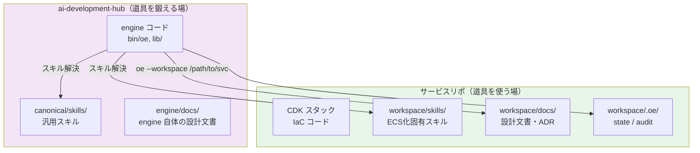
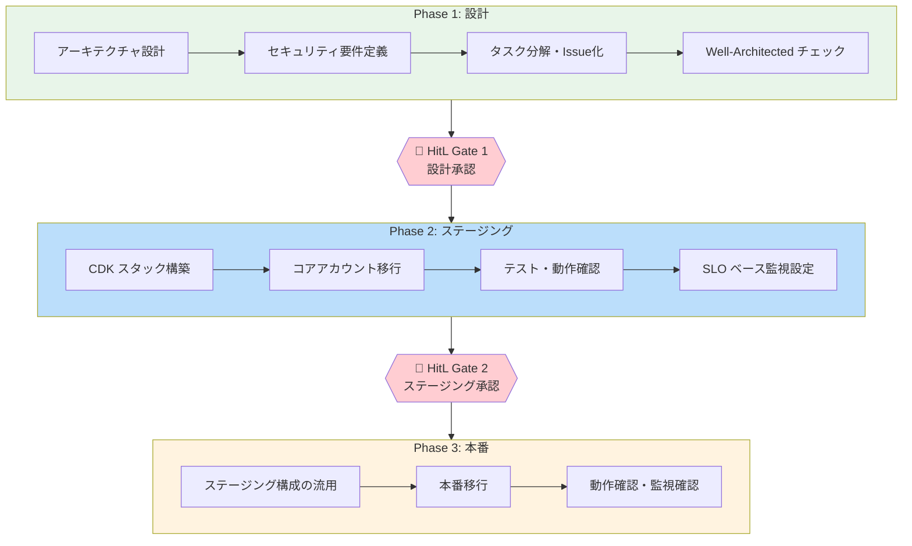
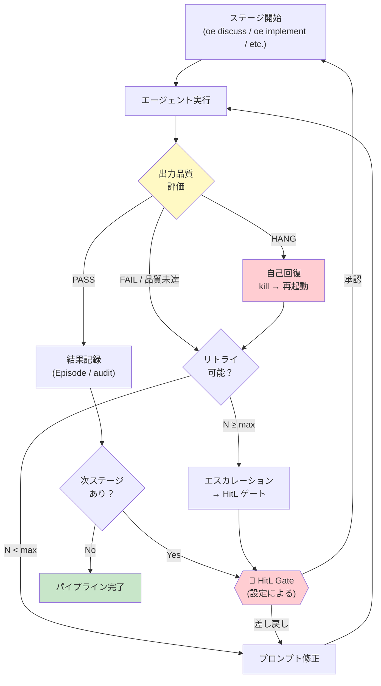

# Phase 5 方針: パイプライン駆動エンジン + ECS 化 target case

> Phase 4 MVP 完了後の Cursor スレッド（2026-05-19）で行われた方針議論を蒸留したもの。Epic [#105](https://github.com/stlwolf/ai-development-hub/issues/105) の起点ドキュメント。

## 議論の経緯

Phase 4 MVP 完了直後、「作ったものが当初の目的に対して有効なのか」という根本的な問いから議論が始まり、target case の発見を経て新方針に収束した。



この経緯を踏まえ、以下にPhase 4の持ち越し認識から新方針の詳細までを整理する。

## 1. Phase 4 からの持ち越し認識

### 1.1 MVP が実証したこと

- WezTerm + wez CLI による cross-process エージェント起動は動作する（物理配管）
- 構造化 audit（JSONL + KVS + marker protocol）で 1 サイクルの再現性を確保できる
- adversarial review（異 CLI × 異モデル）は self-review bias を排除する上で有効
- dogfood（engine 自身のコード改修を engine で行う）が 1 回成功

### 1.2 MVP が実証していないこと

- 多段サイクルの制御（Discussion → Plan → Implementation → Review → ADR のチェーン）
- 状態判定 / リトライ / エスカレーション（制御ループの本体）
- HitL ゲート（停止 + 人間承認 + resume）
- コンテキスト再構築（途中参加エージェントが docs/ から文脈を復元する）
- ドキュメント生成の自動化（spec-card パイプラインの上流）

### 1.3 Baseline との実運用比較

Post-Phase 4 振り返りの結論:

> baseline（Claude Code / Cursor 単体）が日常作業の 80-90% をカバーする。engine は "独立 adversarial review が必須" な 20% の specialized instrument。

engine を daily driver ではなく **パイプライン上の特定ステージで起動される道具** として再定位する。

Phase 4 の成果は無駄ではない — 物理配管は動く。問題は「配管の先に何を流すか」が定まっていなかったこと。Phase 5 ではまずその「何を」を concrete target で固定し、不足する制御ロジックを 1 つずつ埋めていく。

## 2. 根本的な方向転換

### 2.1 Phase 5 direction KickOff (draft) の 3 パスからの離脱

Phase 4 完了時に draft として残した KickOff は:

- Path α': MVP 拡張（機能改善 + 派生 Issue 消化）
- Path β: 異なる abstraction で再構築
- Path γ: 凍結してレイヤー化

いずれも **ツール自体の完成度** を軸にしていた。

### 2.2 新しい方針: ECS 化に特化 → 汎化

Post-Phase 4 振り返りの §4 で target case（EC2 → ECS + IaC 化）が登場し、方向が変わった:

- ツール完成度ではなく、**実際のワークフローが回るかどうか** で判断する
- ECS 化という concrete target で必要な機能を 1 つずつ作り、動くものが揃ったら汎化する
- spec-card パイプライン全段を対象にする（MVP は implementation + review の 1 段だけだった）

### 2.3 制御ループ課題との接続

`docs/draft/orchestration-control-loop-challenges.md`（2026-03）で既に定義されていた課題:

| 制御層の構成要素 | Phase 4 の状態 | Phase 5 で必要 |
|---|---|---|
| 状態判定 | marker scan (binary: pass/warn/fail) | 多段ステージの進行状態 + ドキュメント品質評価 |
| 再投入 | なし | 失敗 / 品質未達時のプロンプト修正 + 再実行 |
| エスカレーション | circuit breaker (timeout/retry count) | N回失敗 → HitL ゲートへフォールバック |
| 進捗共有 | audit JSONL（1 サイクル分のみ） | 全ステージの進行状態を KVS / docs/ 経由で共有 |

3月の構想がそのまま Phase 5 のロードマップになる。ツールの部品は揃いつつあった — 足りなかったのは「ループを回す制御層」そのもの。

## 3. アーキテクチャ判断

### 3.0 全体像: spec-card パイプラインと engine の守備範囲

Phase 4 は Implementation + Review の 1 段だけをカバーしていた。Phase 5 ではパイプライン全段に engine の守備範囲を拡大する。



各ステージに対応する `oe` サブコマンドが 1 つずつ作られ、最終的にパイプラインとして結合される。

### 3.1 呼び出しモデル: Option B（ハイブリッド）の再確認

`architecture-sketch.md` §3 / `skills-level-patterns.md` で確定済み:

- エージェントセッション内から engine を呼び出す（skill / command として）= 協調
- 必要に応じて engine が外部エージェントを spawn する（adversarial review 等）= 制御

Phase 5 でもこのモデルを維持する。`bin/oe` は後者（制御側）として吸収される。



### 3.2 ボトムアップ構築

Phase 4 は top-down（1 サイクル E2E をまず通す）で進めた。Phase 5 は逆:

1. フロー上のフックポイントに **小さなツール**（oe サブコマンド）を 1 つずつ作る
2. 各ツールは単体で使える（CLI pipe 可能）
3. 揃ったらパイプラインとして繋ぐ
4. 繋がったらスキル / コマンドに組み込む



各 `oe` サブコマンドは単体で CLI pipe 可能（`cat context.md | oe discuss --output /tmp/discussion.md`）。揃ったら `oe run` で連結し、最終的にスキル / コマンドとして Cursor / Claude Code に統合する。

### 3.3 2 リポジトリ分離

| リポジトリ | 役割 | 含めるもの | 含めないもの |
|---|---|---|---|
| ai-development-hub | 道具を鍛える場 | engine コード、汎用 skill/command、汎用ドキュメント | サービス固有のドメイン情報 |
| サービスリポ | 道具を使う場 | ワークスペース固有の skill/docs、IaC コード | engine の実装詳細 |

engine は `--workspace <path>` で外部リポジトリの docs / state / audit を操作する。



### 3.4 スキル参照パス拡張

engine がスキルを解決する順序:

1. `canonical/skills/`（ai-development-hub 内の汎用スキル）
2. `<workspace>/skills/` or `<workspace>/.cursor/skills/`（ワークスペース固有スキル）
3. `~/.cursor/skills-cursor/`（ユーザーレベル Cursor スキル）

ECS 化特有のスキル（CDK パターン、セキュリティチェックリスト等）はサービスリポ側に配置する。

## 4. 検証戦略: 段階的適用拡大

`docs/draft/orchestration-control-loop-challenges.md` の 3 段階をそのまま採用:

### 4.1 段階 1: ドキュメント生成（Phase 5 の初期スコープ）

- 制御ループの仕組み自体を確立する段階
- 安全（システムを壊さない）、評価しやすい（テキスト比較）
- spec-card パイプラインの上流（Discussion → KickOff → Plan）を自動化

### 4.2 段階 2: インフラコード生成（Phase 5 中盤以降）

- ドキュメントとインフラコードが 1:1 対応しやすい（ドメイン文脈が薄い）
- CDK synth / deploy で機械的に検証可能
- ドキュメントから同じインフラ成果物が再現できるか = 制御ループの精度指標

### 4.3 段階 3: プロダクトコード生成（将来）

- ドメイン価値の評価基準が加わる
- 0→1 の新規プロダクトに流用する場合に該当
- Phase 5 スコープ外

```mermaid
flowchart LR
    subgraph S1["段階 1: ドキュメント生成"]
        D1["制御ループ確立"]
        D2["spec-card 上流自動化"]
        D3["品質: テキスト比較"]
    end

    subgraph S2["段階 2: インフラコード生成"]
        I1["doc ↔ code 1:1 対応"]
        I2["CDK synth/deploy 検証"]
        I3["品質: 機械的検証"]
    end

    subgraph S3["段階 3: プロダクトコード"]
        P1["ドメイン価値評価"]
        P2["0→1 新規プロダクト"]
        P3["品質: ドメイン判断"]
    end

    S1 -->|"制御ループを<br/>そのまま再利用"| S2
    S2 -->|"評価基準のみ<br/>追加"| S3

    style S1 fill:#c8e6c9
    style S2 fill:#bbdefb
    style S3 fill:#fff3e0,stroke-dasharray: 5 5
```



各段階で制御ループの仕組み自体は共通。変わるのは「評価基準」だけ。これが段階的適用拡大の設計上の利点。

## 5. Target case: EC2 → ECS + IaC 化

### 5.1 概要

サービスの EC2 ベースの本サービスを ECS + IaC（CDK）に移行する。engine にとっての「初の外部ユースケース」であり、Phase 5 の方針がすべてこの target case から逆算される。

### 5.2 フェーズと HitL ゲート



各 Phase 内では engine が自律的にサイクルを回し（ドキュメント生成 → レビュー → 修正）、Phase 間の HitL ゲートで人間が承認する。ゲートを通過しないと次の Phase に進めない。

| フェーズ | 内容 | engine の役割 |
|---|---|---|
| 設計 | アーキテクチャ設計、セキュリティ要件、タスク分解 | Discussion / KickOff 生成、Well-Architected チェック |
| ステージング | CDK スタック構築、コアアカウントへの移行、テスト | Implementation + Review サイクル、HitL ゲート |
| 本番 | ステージング構成の流用、本番移行、動作確認 | 同上 + SLO ベース監視設定 |

### 5.3 参照リソース

- AWS Well-Architected Framework + Container Lens — IaC チェックリスト、セキュリティベストプラクティス
- SRE Workbook — SLO ベース監視の指針
- 既存 CDK スタック — 流用ベース

## 6. 自己回帰ループへの要求

Phase 4 にはなかった、Phase 5 で解決すべきコア要件。これが engine を「配管テスト済みのツール」から「実用的なオーケストレーター」に引き上げるための核心。



### 6.1 リトライ / 品質未達時の再投入

- エージェント出力の品質を評価し、基準未達なら修正プロンプトで再実行
- ドキュメント生成では「必須セクションの欠落」「frontmatter 不正」等を機械判定
- 品質基準はステージごとに異なる（ドキュメント: 構造チェック、インフラコード: synth 成功）

### 6.2 自己回復

- ハング検知 → プロセス kill → 再起動（claude-safe のパターンを engine レベルに）
- タイムアウトをバックグラウンドで管理し、Cursor セッションのタイムアウトに依存しない
- `arena-compare --resume-from` のハング問題も同じパターンで対処可能

### 6.3 進捗の可視化と共有

- 並列エージェントの進捗を中央で管理（ハブ機能）
- 通知（wez notify）による非同期報告
- `oe status` で全ステージの現在地を一覧表示（docs/ のフロントマターから算出）

### 6.4 セッション跨ぎの resume

- 長期タスク（ECS 化 = 数日〜数週）で session を跨いで状態を再開
- docs/ のフロントマターと KVS の状態から「どこまで終わったか」を復元
- resume 時にコンテキストチェーン（related を辿る）で途中参加エージェントにも文脈を提供

## 7. 既存資産の活用

| Phase 4 資産 | Phase 5 での扱い |
|---|---|
| `bin/oe` | `stage_implement.sh` として吸収（implement ステージ） |
| `lib/spawn.sh` / `lib/monitor.sh` | エージェント起動 + 監視の基盤として継続利用 |
| `lib/capture.sh` / `lib/verify.sh` | marker protocol + 構造判定を各ステージに汎化 |
| `lib/envelope.sh` | タスク記述フォーマットを拡張（ステージ情報追加） |
| `lib/kvs.sh` | 状態永続化の基盤として拡張（ステージ状態の追跡） |
| audit JSONL | 全ステージの audit を統合ログとして記録 |
| marker protocol | ステージごとのマーカーを追加（`@@OE_STAGE_COMPLETE` 等） |

## 8. 思想の核心: なぜ自前で作るのか

議論の中で繰り返し浮上したテーマを整理しておく。

**コンテキストが本質**。ライブラリやフレームワーク（LangGraph 等）は実行制御を提供するが、AI 開発における本質的な課題はコンテキストの構造化と保存。それはドキュメントルールとして表現できるため、ツールレイヤーは薄く保ち、不要になったら捨てられる（Build to Delete）。

**ドキュメントルールの代替可能性**。独自仕様は「ドキュメント運用ルールのガードレール」でしかない。仮にオーケストレーションツールに載せ替えても、コンテキスト（= ドキュメント）自体は再利用できる。インフラコードもイミュータブルが前提なので、どの仕様で書いても再現性がある。

**ライブラリ陳腐化リスク**。AI 開発の進歩速度を考えると、特定ライブラリへの依存は陳腐化リスクが高い。本質的な課題（コンテキスト管理）に直接対応する形で作っておけば、外部ツールが進化しても載せ替えが効く。

**段階的な自律度向上**。Phase 4 で実証した「判断以外は自動化」のラインを、Phase 5 では「判断ポイントを明示的にゲート化し、ゲート間は完全自律」に引き上げる。最終的にはゲートの数を減らしていくことで自律度が上がる。

## 9. open questions

- [ ] `bin/oe` のサブコマンド体系をどこまで事前設計するか vs 必要に応じて追加するか
- [ ] KVS を bash + ファイルのまま維持するか、SQLite 等に移行するか
- [ ] Cursor CLI (`arena-compare`) の自己回帰ループ化は独立プロジェクトか engine に統合か
- [ ] `arena-compare --resume-from` のハング問題をどう扱うか（Phase 5 prerequisite か別件か）
- [ ] target case の設計ドキュメントは ai-development-hub / サービスリポのどちらに初期配置するか
- [ ] コンテキストチェーン（related を辿る再構築）の実装粒度 — 全文読み込み vs サマリ抽出

## 10. Step 分解 proposal (Phase 5 着手時の sub-issue 化候補)

> Epic [#105](https://github.com/stlwolf/ai-development-hub/issues/105) のチェックリスト 8 項目 + 検証戦略 3 段階 (§4) を Step 5-X に粒度化した提案。Phase 5 着手時に再評価する想定 (本 Discussion の closed 化に合わせて確定)。
>
> 進め方は Phase 4 と同じく **Step 単位で駆動層 doc サイクル** (Discussion → KickOff → Plan → Episode → ADR) を回す。

### 10.1 Step 分解案 (順序付き、段階 1 = ドキュメント生成スコープに絞り込み)

| Step | 内容 | 関連機能 (Epic #105 §「Phase 5 で追加する主要機能」) | 想定サイズ |
|---|---|---|---|
| **Step 5-0 (Prerequisite)** | open questions (§11) のうち blocking なものを closed 化 + `bin/oe` 互換性方針確定 (§12) | 全機能の前提 | 小 (Phase 5 着手前 doc only) |
| **Step 5-1** | Phase 4 既存資産の整理 + サブコマンド体系 (`oe discuss / kickoff / plan / implement / record / decide / status`) 設計 + skill 参照パス拡張 (`canonical/` → `<workspace>/` → user `~/.cursor/`) | 機能 6 (スキル参照パス) + 機能 8 前段 (bin/oe 吸収) | 中 |
| **Step 5-2** | ドキュメント生成サブコマンド v1 (`oe discuss / kickoff / plan` の最小実装、frontmatter 自動生成 + 必須セクション骨格生成) | 機能 7 (上流ドキュメント生成) + 機能 1 一部 (ステージ管理) | 中 |
| **Step 5-3** | 制御ループ v1 (状態判定 + リトライ + エスカレーション) + 品質評価 (機械判定可能な範囲: frontmatter 不正 / 必須セクション欠落) | 機能 3 (制御ループ) | 中〜大 |
| **Step 5-4** | HitL ゲート + resume + state 永続化拡張 (audit log + KVS から「どこまで終わったか」復元) | 機能 2 (HitL + resume) + 機能 1 完成 | 大 |
| **Step 5-5** | コンテキスト再構築 (related チェーン辿り、途中参加エージェントへの文脈提供) | 機能 4 (コンテキスト再構築) | 中 |
| **Step 5-6** | 外部 workspace 対応 (`--workspace <path>` で外部リポジトリの docs / state / audit を操作)、target case の準備 | 機能 5 (外部ワークスペース) | 中 |
| **Step 5-7** | Phase 4 `bin/oe` の吸収完了 + Episode/ADR 生成サブコマンド (`oe record / decide`) | 機能 8 (bin/oe 吸収) 完成 | 中 |
| **Step 5-8** | **段階 1 完了 E2E 検証**: ドキュメント生成パイプライン全段 (Discussion → KickOff → Plan → Implementation → Episode → ADR) の自律実行を実機で実証 | Phase 4 Step 4-4 相当の段階 1 版 | 大 |
| (段階 2 以降) | インフラコード生成 (CDK synth/deploy 検証含む) + target case (ECS 化) 着手は Step 5-8 完了後に **別 sub-Epic として判断** | 検証戦略 §4.2 (機能拡張ではなく評価基準追加) | (Phase 5.2 として別途) |

### 10.2 Step ごとの駆動層 doc サイクル想定

Phase 4 と同じく:

```
各 Step 着手:
  1. Discussion (status: draft → closed): QDD で論点を closed 化
  2. KickOff (status: confirmed): DI 確定
  3. Plan (status: ready): Phase / Step に展開
  4. 実装 (PR): Phase 構造に沿って commit + push
  5. Episode (status: stable): 経緯記録
  6. ADR (status: accepted、必要に応じて): 設計判断の蒸留
```

ただし Phase 4 と異なり Phase 5 では:

- **HitL ゲートが Step 内にも存在**: 制御ループの実装上、Step 内で人間承認が要件
- **段階 1 (ドキュメント生成) と段階 2 (インフラコード) の境界**: 段階 1 完了時点で **「Phase 5.1 完了 + 段階 2 = Phase 5.2 を別 sub-Epic として起票」する判断**を挟む

### 10.3 Step 分解の不確実性

- Step 5-3 (制御ループ) と Step 5-4 (HitL + resume) の **依存関係** は実装で確定する想定 (制御ループが HitL ゲートをトリガするので 5-3 → 5-4 順だが、resume 設計が 5-3 を圧迫する可能性あり)
- Step 5-5 (コンテキスト再構築) は Step 5-4 までで必要十分なら **後ろ倒し or skip 可**
- Step 5-6 (外部 workspace) を Step 5-2 直後に持ってきて **target case を早く触る**選択肢もある (= dogfood しながら engine 拡張、retrospective §4 推奨経路)

→ **Step 分解の確定は Phase 5 着手時に再評価**、本節は現時点の輪郭。

---

## 11. open questions §9 の整理 (依存関係 + closed 化順序)

> §9 の 6 件を Phase 5 着手 blocking 度 + 依存関係で整理。本節は closed 化計画であり、Q 自体の closed 化は別 session (Phase 5 Discussion 段階) で個別 QDD する。

### 11.1 整理表

| Q | 内容 | Phase 5 着手 blocking? | 依存 | closed 化タイミング推奨 |
|---|---|---|---|---|
| **Q9.1** | `bin/oe` サブコマンド体系をどこまで事前設計 vs 必要に応じて追加 | **高** | §12 `bin/oe` 互換性方針と密接 | **Step 5-0 (Prerequisite) で必須 closed** |
| Q9.2 | KVS を bash + ファイル維持 vs SQLite 等に移行 | 低 | 段階 2 (インフラコード生成) 以降で実害化 | Step 5-3 (制御ループ) or Step 5-4 (resume) で判断 |
| Q9.3 | `arena-compare` の自己回帰ループ化を独立 PJ か engine に統合 | 中 | 制御ループ設計 (Step 5-3) と関連 | Step 5-3 と並行で判断、別 PJ として切り出す可能性あり |
| **Q9.4** | `arena-compare --resume-from` のハング問題は Phase 5 prerequisite か別件か | **中〜高** | resume 機能 (Step 5-4) の前提 | **Step 5-0 (Prerequisite) で要否確定**、別件なら派生 Issue 化 |
| Q9.5 | target case の設計 doc を ai-development-hub / サービスリポのどちらに初期配置 | 中 | 2 リポジトリ分離方針 (§3.3) と関連 | Step 5-6 (外部 workspace 対応) 着手前 |
| Q9.6 | コンテキストチェーンの実装粒度 (全文読み込み vs サマリ抽出) | 低 | Step 5-5 (コンテキスト再構築) の設計判断 | Step 5-5 着手時 |

### 11.2 Phase 5 着手前 (Step 5-0) で必須 closed 化

- **Q9.1**: サブコマンド体系を「事前完全設計 (Phase 4 oe の置換含む全 design)」「最小骨格 (Step 5-2 だけ事前設計、残りは Step 着手時)」「逐次追加 (各 Step で追加するサブコマンドを Step 内で設計)」のどれにするか
- **Q9.4**: `arena-compare --resume-from` ハングは
  - (a) Phase 5 prerequisite として engine に統合前に修正
  - (b) 別件 PJ として切り出し、engine 側は独自 resume 実装
  - (c) 当面回避策 (ハング時は手動 kill + restart) で進める

これらは Step 5-1 着手前に Discussion で詰めることで、Step 5-1 以降の設計の前提が固まる。

### 11.3 Step 着手時 closed 化 (4 件)

- **Q9.2**: Step 5-3 (制御ループ) or Step 5-4 (resume) — bash+file の限界が顕在化するタイミング
- **Q9.3**: Step 5-3 と並行 — `arena-compare` 統合判断は制御ループ設計の射程に依存
- **Q9.5**: Step 5-6 (外部 workspace) — 2 リポジトリ分離が実装で具体化するタイミング
- **Q9.6**: Step 5-5 (コンテキスト再構築) — 実装方針の選択

---

## 12. `bin/oe` 互換性方針 (Phase 5 で吸収する際の選択肢)

> Phase 4 で完成した `bin/oe` (= 1 サイクル E2E 実証済み) を Phase 5 の新サブコマンド体系にどう統合するか。Step 5-0 (Prerequisite) で Q9.1 と合わせて確定する想定の選択肢メモ。

### 12.1 選択肢比較

| 案 | 概要 | 利点 | 欠点 | 評価 |
|---|---|---|---|---|
| **A** | Phase 4 `bin/oe` を **frozen 保持**、Phase 5 oe (新サブコマンド体系) は別 binary (例: `bin/oe-v5` or `bin/oe2`) | Phase 4 互換性 100%、既存 PR / Episode への参照リンク維持、ロールバック容易 | binary 2 つの保守コスト、user 側の使い分けが必要、deprecation 議論が後で発生 | △ |
| **B (推奨)** | **同一 binary でサブコマンド拡張**、旧呼び出し (`bin/oe "<task>"` or `--task-file`) は **alias / shim** として維持 | 連続性確保、外部参照 (Episode / PR / ADR / architecture-sketch §11) が破壊されない、user 視点で 1 binary | alias の管理、旧呼び出し経路と新呼び出し経路の挙動差が混在 | ◯ 推奨 |
| C | Phase 4 `bin/oe` を **deprecate**、新 binary に完全移行 (旧呼び出しは消去) | binary 1 つで clean、技術負債なし | 過去 PR / Episode への参照リンク破壊、re-run 不可、frozen 文書 (architecture-sketch §11) との整合性問題 | ✗ |

### 12.2 推奨 = B

理由:

- Phase 4 の audit log + KVS は **「過去サイクルの再現性」を担保**する設計だった (architecture-sketch §11.3 「Reproducibility」)。binary を変えると過去 KVS が再 run 不可になり、設計思想と矛盾
- Episode / ADR / PR description で `bin/oe --task-file ...` を引用している箇所が複数ある (Step 4-4 Episode、Step 4-5 PR #104 等)。これらが死ぬのは documentation hygiene 上 NG
- alias / shim の保守コストは小さい (= `bin/oe "$@"` の冒頭で旧呼び出しパターンを検出して新サブコマンドに dispatch するだけ)

### 12.3 案 B の実装イメージ (Step 5-0 / Step 5-1 で詰める)

```bash
# bin/oe (Phase 5 後)
#
# 新呼び出し:
#   bin/oe discuss --topic "<...>"
#   bin/oe kickoff <discussion_path>
#   bin/oe plan <kickoff_path>
#   bin/oe implement --task-file <path>   # = Phase 4 互換、alias
#   bin/oe record --session <sid>
#   bin/oe decide --episode <path>
#   bin/oe status [--workspace <path>]
#   bin/oe run --from <stage> --to <stage>
#
# 旧呼び出し (Phase 4 互換、alias):
#   bin/oe "<task>"              → bin/oe implement --task "<task>"
#   bin/oe --task-file <path>    → bin/oe implement --task-file <path>
```

旧呼び出し検出は `$1` が予約サブコマンド (`discuss / kickoff / plan / implement / record / decide / status / run`) に一致しない場合に implement に dispatch する形で実現可能。

### 12.4 残論点 (Step 5-0 で決定)

- alias / shim の deprecation スケジュール (= Phase 5 安定後にいつ Phase 4 互換 alias を消すか) — 現時点では「**当面維持、Phase 6 以降で議論**」が妥当
- 新サブコマンドの命名規約 (`discuss / kickoff / plan / implement / record / decide` の動詞統一感は OK か、それとも別命名 `gen-discussion / gen-kickoff` 等にするか) — Step 5-1 で確定
- `oe run --from <stage> --to <stage>` の引数仕様 — Step 5-2 (パイプライン結合段階) で確定

---

## 関連リンク

- Epic: [#105](https://github.com/stlwolf/ai-development-hub/issues/105)（本 Discussion の追跡先）
- Closed Epic: [#19](https://github.com/stlwolf/ai-development-hub/issues/19)（Phase 4）
- Post-Phase 4 振り返り: [`docs/episodes/2026-05-19-retrospective-post-phase-4-baseline-vs-engine-and-target-case.md`](../episodes/2026-05-19-retrospective-post-phase-4-baseline-vs-engine-and-target-case.md)
- Phase 5 direction KickOff (draft): [`docs/plans/2026-05-18-kickoff-phase-5-direction.md`](../plans/2026-05-18-kickoff-phase-5-direction.md)
- 制御ループ課題: [`docs/draft/orchestration-control-loop-challenges.md`](../../../../docs/draft/orchestration-control-loop-challenges.md)
- architecture-sketch (frozen): [`projects/orchestration-research/synthesis/architecture-sketch.md`](../../../orchestration-research/synthesis/architecture-sketch.md)
- [Cursor スレッド (元議論)](8862fdf0-509f-4913-86d5-c2ef63745c19)
