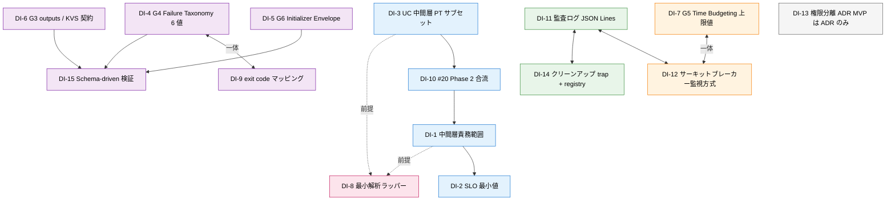

# Step 4-1: エンベロープ + ディスパッチャの骨格 — KickOff

> 本 KickOff は Step 4-0 [Discussion](../discussions/2026-05-13-discussion-engine-scope-and-goals.md) の 15 論点から「設計判断が必要なもの」を抽出して整理する。判断そのものは本 KickOff では行わず、後続の Plan / ADR で確定する。

## 背景

- [Epic #19](https://github.com/stlwolf/ai-development-hub/issues/19) Phase 4 MVP 実装の Step 4-1。Step 4-0 Discussion で MVP スコープ・3 UC・MVP に含む / 含まない要素が仮置きされた
- 設計入力: Discussion 本体（15 論点）+ `projects/orchestration-research/synthesis/architecture-sketch.md`（frozen 正本として参照）+ Harness ギャップ（[#37](https://github.com/stlwolf/ai-development-hub/issues/37) G1〜G7）+ [#81](https://github.com/stlwolf/ai-development-hub/issues/81) Step 4-0 サブ Issue 成果物
- Step 4-1 の主題: **コンテキスト・エンベロープ（読む docs / 使う skill / 出力先 / 終了条件）と、それを CLI 呼び出しに変換する薄いディスパッチャ**の骨格構築
- 観測層 Issue（Read-only）:
  - [#19](https://github.com/stlwolf/ai-development-hub/issues/19): Epic 親。本 Step を含む 4-0〜4-5 のステップ管理
  - [#81](https://github.com/stlwolf/ai-development-hub/issues/81): Step 4-0 サブ Issue。Discussion 成果物を保持し、本 KickOff の前提条件
  - [#37](https://github.com/stlwolf/ai-development-hub/issues/37): Harness ギャップ G1〜G6。G3 State Semantics / G4 Failure Taxonomy / G5 Time Budgeting / G6 Initializer Envelope の各最小版を本 Step が取り込む

## スコープ

### 本 KickOff のスコープ

- Step 4-0 Discussion の 15 論点から「Step 4-1 で設計判断が必要な論点」を抽出し Decision Items として列挙
- 各 Decision Item に「論点 ID」「概要」「紐づく UC」「想定選択肢の方向性」「前提・必要な調査」を付与
- Open Questions / 依存関係 / 次アクション（kickoff-to-plan で TODO 展開すべき箇所）を明示

### 本 KickOff のスコープ外

- 設計判断そのものの確定（Plan / ADR で行う）
- Discussion 本体・`architecture-sketch.md` の改変（frozen）
- 観測層 Issue の作成・更新

## Decision Items

> 評価基準: Step 4-1（エンベロープ + ディスパッチャ骨格）に直接影響する論点を `Yes` / `Partial` で抽出。`No` の論点は本 KickOff から除外（理由は §Open Questions の「除外論点」を参照）。
>
> UC 略記: `UC-1` メインによる調査サブ監視 / `UC-2` 並列実装の協調 / `UC-3` 人間俯瞰 + TTY 割り込み。

### DI-1: 中間層プロトコル要件のディスパッチャ側責務範囲（論点 3, Partial）

- **概要**: 3 層モデルのうち中間層（通信プロトコル）の責務を、Step 4-1 のディスパッチャがどこまで内包するか確定する
- **紐づく UC**: UC-1 / UC-2 / UC-3（全 UC に影響）
- **想定選択肢の方向性**（列挙のみ）:
  - 案 A: ディスパッチャは CLI 起動と envelope 注入のみ。中間層 API（`wez pane capture` 等）の呼び出しは別レイヤ
  - 案 B: ディスパッチャに最小限の中間層 API 呼び出し（capture / send / kill）を含む薄いライブラリ層を統合
  - 案 C: ディスパッチャは Bash 関数として中間層 API をラップし、UC ごとの「監視ループ関数」を提供
- **前提・必要な調査**: 論点 9（[#20](https://github.com/stlwolf/ai-development-hub/issues/20) Phase 2 連携）の中間層プロトコル仕様確定が先行する場合あり

### DI-2: オープンループ自律サイクルの最小 SLO 具体値（論点 4, Yes）

- **概要**: ポーリング方式の `spawn → liveness/progress取得 → completion/blocked検知 → interrupt可能 → artifact handoff` サイクルにおける最小 SLO（数値）の確定
- **紐づく UC**: UC-1（監視ループの主要 SLO）/ UC-2（KVS 監視間隔）/ UC-3（人間決定の検知遅延）
- **想定選択肢の方向性**:
  - SLO 候補軸: 状態変化検知の上限秒数 / interrupt ack までのターン上限 / artifact handoff 完了の所要秒数
  - 例示値（数値は未確定）: 「5 秒以内に状態変化検知」「次 heartbeat までに interrupt ack」「サイクル完走 30 分以内」
- **前提・必要な調査**: ポーリング間隔の現実的下限（`wez pane capture` の所要時間計測）

### DI-3: UC 3 本の中間層プロトコル要件のうち Step 4-1 で実装する範囲（論点 5, Partial）

- **概要**: Discussion §5 の各 UC「中間層プロトコル要件」5 項目のうち、4-1 で骨格を作る最小サブセットを決める
- **紐づく UC**: UC-1 / UC-2 / UC-3
- **想定選択肢の方向性**:
  - 案 A: 3 UC 共通の最小集合（`session_id ⇔ pane_id` registry、capture API、`wez pane send`、状態語彙閉集合）のみ 4-1 で実装
  - 案 B: 案 A に加え、UC-2 のファイルベース KVS スキーマも 4-1 に含める
  - 案 C: UC-3 の dashboard API は 4-3 / 4-4 に延期し、UC-1/UC-2 中心で 4-1 を組む
- **前提・必要な調査**: 各 UC の Plan 段階で「最小 1 サイクル完走」に必要な API リストを再評価

### DI-4: G4 Failure Taxonomy 6 値スキーマ（論点 6, Yes）

- **概要**: `success / partial / retryable_failure / blocked / protocol_error / timeout` の 6 値を、エンベロープ / 成果物パース / 監査ログでどう表現するか確定する
- **紐づく UC**: UC-1 / UC-2 / UC-3（全 UC が失敗分類に依存）
- **想定選択肢の方向性**:
  - 値の枚挙キーは確定（6 値）。判断対象は「フィールド名」「JSON Schema 上の enum 表現」「成果物ファイル側の格納場所（frontmatter or 専用 status ファイル）」
- **前提・必要な調査**: 論点 8（exit code ↔ G4 マッピング）と一体で確定

### DI-5: G6 Initializer Envelope スキーマ（論点 6, Yes）

- **概要**: 「読む docs / 使う skill / 出力先 / 終了条件」を JSON / YAML / Markdown frontmatter のいずれで表現し、ディスパッチャがどう注入するか確定する
- **紐づく UC**: UC-1 / UC-2 / UC-3（全 UC のサブエージェント起動時に envelope を渡す）
- **想定選択肢の方向性**:
  - 案 A: JSON 単一ファイル（`envelope.json`）+ ディスパッチャが CLI 引数 / 環境変数 / プロンプト先頭に展開
  - 案 B: Markdown frontmatter（spec-card 形式踏襲）+ 本文に「初期プロンプト」直書き
  - 案 C: ハイブリッド（構造化部分は JSON、人間可読プロンプトは Markdown）
- **前提・必要な調査**: 既存 spec-card frontmatter との整合性、`canonical/skills/*/SKILL.md` の `outputs:` 宣言フォーマット

### DI-6: G3 State Semantics の `outputs:` 宣言フォーマットと共有 KVS 契約（論点 6, Yes）

- **概要**: skill / コマンドの「何を生成し、どこに置くか」の宣言フォーマットと、UC-2 用ファイルベース KVS の最小契約を確定する
- **紐づく UC**: UC-2（中心、KVS 契約）/ UC-1（artifact handoff 経路）
- **想定選択肢の方向性**:
  - `outputs:` 宣言の場所: `SKILL.md` frontmatter / 独立宣言ファイル / envelope 内
  - KVS 形式: 単一 JSON / JSON Lines 追記 / ディレクトリ + 個別 JSON ファイル
  - ロック戦略: `flock` / atomic rename / lockfile なし（単一ライター前提）
- **前提・必要な調査**: 既存 `canonical/skills/` の SKILL.md に `outputs:` 相当がないかの確認（4-1 Plan で実施）

### DI-7: G5 Time Budgeting の上限値とエンベロープへの注入経路（論点 6, 12, Yes）

- **概要**: 時間 / ターン / ペイン数 / コスト上限の具体値、および envelope → サブエージェント実行時環境への注入方法を確定する
- **紐づく UC**: UC-1 / UC-2 / UC-3（全 UC が上限到達時に `timeout / blocked` 停止）
- **想定選択肢の方向性**:
  - 例示値: 時間 30 分 / ターン 10 回 / 同時ペイン 5 個 / コスト optional
  - 注入経路: 環境変数 / envelope JSON フィールド / wrapper script の引数
  - 上限到達時の挙動: ディスパッチャ側で監視 + kill / サブエージェント側 self-monitor
- **前提・必要な調査**: 現実的な作業所要時間の実測（既存 episode 等から推定可能か）

### DI-8: ディスパッチャの責務範囲と「最小解析ラッパー」の中身（論点 7, Partial）

- **概要**: ディスパッチャが CLI ラッパー層に留まるか、「ポーリング出力の装飾除去・状態抽出」の最小解析ラッパー機能をどこまで持つか確定する
- **紐づく UC**: UC-1（出力からの progress / blocked 抽出が中心）
- **想定選択肢の方向性**:
  - 案 A: 純粋な CLI ラッパー（起動 + envelope 注入 + exit code 取得のみ）
  - 案 B: 案 A + 出力末尾の「終了マーカー」スキャン（例: `===STATE: done===` 等）
  - 案 C: 案 B + ANSI 装飾除去 / 状態語彙閉集合の正規表現抽出
- **前提・必要な調査**: 各 CLI（claude / codex / cursor）の出力形式調査、状態マーカーをサブエージェント側で出力させる契約の設計

### DI-9: exit code ↔ G4 6 値マッピングの分岐ルール（論点 8, Partial）

- **概要**: [#22](https://github.com/stlwolf/ai-development-hub/issues/22) で確立した `0 / 1 / 2` 体系を G4 6 値に分岐するルールを確定する（timeout / blocked / protocol_error の判別軸）
- **紐づく UC**: UC-1（サブの exit code 受信時の分類）/ UC-2（並列セッション集約時）
- **想定選択肢の方向性**:
  - exit code 単独では判別不能。補助シグナル候補: ディスパッチャ側のタイマー / サブの最終出力マーカー / 監査ログのイベント種別
  - マッピング表案: `0 → success`, `1 → partial`, `2 → retryable_failure | protocol_error`, タイマー超過 → `timeout`, 明示マーカー → `blocked`
- **前提・必要な調査**: [#36](https://github.com/stlwolf/ai-development-hub/issues/36) 多周制御仕様文書の参照

### DI-10: [#20](https://github.com/stlwolf/ai-development-hub/issues/20) Phase 2 中間層プロトコルとの合流点（論点 9, Yes）

- **概要**: 中間層プロトコル仕様（registry / KVS / 監査ログ / SLO）をどの粒度で ADR 化し、`#20` Phase 2 と engine 側のどちらの `decisions/` に置くか確定する
- **紐づく UC**: UC-1 / UC-2 / UC-3（中間層 API 全般）
- **想定選択肢の方向性**:
  - 配置案: engine 側 `decisions/` 単独 / wezterm-ai-mode 側 `decisions/` 単独 / 両方に同一 ADR の symlink or 相互参照
  - 合流タイミング: 4-1 Plan 着手前 / 4-1 完了時 / 4-2 着手前
- **前提・必要な調査**: [`projects/wezterm-ai-mode/docs/`](../../../wezterm-ai-mode/docs/) の既存 ADR 配置慣例

### DI-11: 監査ログ JSON Lines スキーマと記録粒度（論点 11, Yes）

- **概要**: `audit/` 配下に追記する JSON Lines のフィールド構成、記録対象イベント、リプレイ可能性の最小担保レベルを確定する
- **紐づく UC**: UC-1（状態遷移）/ UC-2（KVS 更新）/ UC-3（人間決定）
- **想定選択肢の方向性**:
  - 必須フィールド候補: `ts / session_id / pane_id / event_type / state / payload`
  - 記録対象: 状態遷移 / G4 失敗分類 / 人間割り込み / クリーンアップ実行
  - 粒度: コマンド単位の完全再現は MVP 外。1 サイクル再構成可能な粒度を担保
- **前提・必要な調査**: 既存 `tmp/arena-*/summary.md` 等のログ形式が参考になるか

### DI-12: サーキットブレーカー上限値とディスパッチャでの監視方式（論点 12, Yes）

- **概要**: 時間 / ターン / ペイン数（コストは optional）の具体上限値、および「ディスパッチャが監視 / サブ self-monitor / 親エージェント側」のいずれが上限到達を検知するか確定する
- **紐づく UC**: UC-1 / UC-2 / UC-3
- **想定選択肢の方向性**:
  - 上限値: DI-7 と整合（時間 30 分 / ターン 10 / ペイン 5 等の例示値の確定）
  - 監視主体: ディスパッチャ常駐プロセス / Bash の `timeout` コマンド / cron 的別プロセス
- **前提・必要な調査**: `timeout` コマンドと `wez pane kill` 連携の挙動確認

### DI-13: 権限分離 ADR の境界条件（論点 13, Partial）

- **概要**: 「MVP は全サブ親同等権限」とする前提を明文化し、Phase 5 以降の sandbox / ReadOnly 化トリガー条件を ADR の前提として記述する
- **紐づく UC**: UC-1 / UC-2 / UC-3
- **想定選択肢の方向性**:
  - ADR の必須記述: 現状の権限境界 / トリガー条件（共同開発開始 / チーム運用 / 公開リポジトリ運用）/ 将来の sandbox 候補（Docker / OS user 分離 / careful-operations-rule のフック強化）
- **前提・必要な調査**: 既存 careful-operations 系フック（`canonical/hooks/`）との接続点

### DI-14: クリーンアップ戦略の registry 構造と trap 範囲（論点 14, Yes）

- **概要**: engine の PID と紐づくペイン一覧をどう保持し、`trap EXIT INT TERM` の範囲（dispatcher プロセス単位 / engine プロセス全体 / 親エージェントクラッシュ時）を確定する
- **紐づく UC**: UC-1 / UC-2 / UC-3（全 UC で orphaned ペイン発生リスク）
- **想定選択肢の方向性**:
  - registry 案: 単一 JSON / `wez pane list` を都度叩く / ハイブリッド
  - trap 範囲: dispatcher 単独 / engine 単独 / 親エージェント側にも cleanup フック注入
  - クラッシュ時の検知: PID ファイル + 定期 liveness check / signal-driven
- **前提・必要な調査**: `wez pane kill` の信頼性確認、ゾンビ検出の現実的閾値

### DI-15: Schema-driven Boundaries の検証ツールと差し戻し動作（論点 15, Yes）

- **概要**: envelope（4-1 入力）/ 成果物（4-2 出力）の JSON Schema を定義し、`ajv` / `jq --exit-status` / 独自 jq クエリのどれで検証するか、failure 時の「元エージェントへの差し戻し」フローを確定する
- **紐づく UC**: UC-1 / UC-2 / UC-3（全 UC で envelope / 成果物の schema 検証必要）
- **想定選択肢の方向性**:
  - 検証ツール: `ajv-cli` / `jq --exit-status` / `python3 -m jsonschema`
  - 差し戻し: 即座に同サブエージェントへ再投入 / 親エージェントに通知して再 spawn / 監査ログ記録 + 人間判断
- **前提・必要な調査**: 既存 `canonical/hooks/` 内の schema 検証パターンの有無、`jq` だけで JSON Schema を厳格検証可能か

## DI 依存関係

> Discussion §「論点間の依存関係」を本 KickOff の DI 体系に再写像する。Plan のフェーズ順序決定および TODO 配置順の根拠となる。
>
> 表現形式の注: 本グラフは Mermaid `flowchart` で記述。GitHub native レンダリングと機械抽出（AST）の両立を狙う。「依存関係の正本を JSON Schema 化し Mermaid を派生レンダリングする」という思想的に一貫した案は識別済みだが、本 Step ではスコープ外（[`docs/episodes/2026-05-14-episode-dependency-representation-canonical-form.md`](../episodes/2026-05-14-episode-dependency-representation-canonical-form.md) に記録）。

凡例:

- 矢印 `-->`: 強依存（A の確定が B の前提）
- 双方向 `<-->`：一体扱い（同フェーズで同時に確定すべき）
- 点線 `-.前提.->`: 前提依存（A 確定後に B 着手可能）
- 色分け（`classDef`）: 駆動系 / Schema 系 / SLO 系 / 観測性 / 実装 / 独立 ADR

主要依存（Plan 着手前に念頭に置くべきもの）:

- `DI-3 → DI-10 → DI-1 → DI-2`: UC 起点でディスパッチャ責務と SLO を逐次確定する直列パス
- `DI-4 ↔ DI-9`: 失敗分類とマッピングルールは一体で扱う（Plan 上で同フェーズに配置）
- `DI-15 ⊃ {DI-4, DI-5, DI-6}`: Schema 検証は他 Schema 定義の上に乗るため後段
- `DI-7 ↔ DI-12`: 上限値（数値）と監視方式（実装）は同じ数値群を扱うため一体化
- `DI-8` は `DI-1 / DI-3` の確定後に着手（依存解決順序の重要分岐）

## Open Questions

### 除外論点（No 評価、Step 4-1 では判断不要）

- **論点 1（docs 配置の方針）**: 既存パターン（`projects/wezterm-ai-mode/docs/`）踏襲が Discussion §1 で確定。本 Step での再判断不要
- **論点 2（research との関係）**: 「frozen 参照のみ」が Discussion §2 で確定。本 Step での再判断不要
- **論点 10（dogfood 化判断基準）**: 4-5 フィードバック時点での再評価が Discussion §10 で確定。本 Step では延期

### Step 4-1 全体に関わる横断的な未決事項

- DI-1（中間層責務範囲）と DI-3（UC 中間層プロトコル要件のサブセット）は相互依存。Plan 段階でどちらを先に確定するかの順序判断が必要
- DI-10（[#20](https://github.com/stlwolf/ai-development-hub/issues/20) Phase 2 合流）は engine と wezterm-ai-mode の **両プロジェクト横断 ADR** の可能性あり。本 Step Plan 着手前に [#20](https://github.com/stlwolf/ai-development-hub/issues/20) 側の進捗確認が必要
- DI-4（G4 6 値）と DI-9（exit code マッピング）は 4-3 検証ゲートの前提でもあるため、本 Step での確定が後工程の手戻りを減らす

## 依存・参照

### 直接依存

- Step 4-0 [Discussion](../discussions/2026-05-13-discussion-engine-scope-and-goals.md)（frozen、本 KickOff の判断対象抽出元）
- `projects/orchestration-research/synthesis/architecture-sketch.md`（frozen 正本として参照、改変禁止）

### 観測層 Issue（Read-only）

- [#19](https://github.com/stlwolf/ai-development-hub/issues/19) — Epic 親、Phase 4 ステップ管理
- [#84](https://github.com/stlwolf/ai-development-hub/issues/84) — 本 KickOff の観測層サブ Issue（進捗トラッキング先、ステップチェックボックス更新あり）
- [#81](https://github.com/stlwolf/ai-development-hub/issues/81) — Step 4-0 サブ Issue、Discussion 成果物
- [#37](https://github.com/stlwolf/ai-development-hub/issues/37) — Harness G1〜G6（G3/G4/G5/G6 が本 Step 直結）

### 並行・合流候補

- [#20](https://github.com/stlwolf/ai-development-hub/issues/20) Phase 2 中間層プロトコル設計（DI-10 で合流）
- [#22](https://github.com/stlwolf/ai-development-hub/issues/22) / [#36](https://github.com/stlwolf/ai-development-hub/issues/36) CLOSED — exit code 契約・多周制御終了条件仕様（DI-9 の前提）
- [#47](https://github.com/stlwolf/ai-development-hub/issues/47) 並列セッション運用要件（UC-2 / DI-6 の補助入力）

### 設計コンテキスト

- `docs/specs/2026-04-27-discussion-cli-wrapper-layers-and-token-discipline.md` — CLI ラッパー 4 層モデル（DI-8 の前提）
- [`projects/wezterm-ai-mode/docs/`](../../../wezterm-ai-mode/docs/) — docs 配置パターンの参照元

## 完了条件

> 本 KickOff は以下を満たした時点で完了とする。Plan 着手後の判定基準でもある。

- [ ] 全 12 Decision Items（DI-1〜DI-15）について、Plan で「決定」+「対応 ADR/Episode 化」のタスクペアが定義されている
- [ ] DI-1 / DI-3 / DI-8 の相互依存解消順序が Plan 冒頭で明示されている（DI 依存関係グラフ準拠）
- [ ] DI-4 と DI-9 が一体扱いで Plan の同フェーズに配置されている
- [ ] [#20](https://github.com/stlwolf/ai-development-hub/issues/20) Phase 2 現状確認が Plan の最初の TODO として配置されている
- [ ] Plan 冒頭に `kickoff-to-plan` SKILL の §「変換上の判断メモ」が埋め込まれている（KickOff↔Plan 遷移記録）
- [ ] frontmatter `status` が `in-development` 以上に昇格している
- [ ] 観測層 Issue（[#84](https://github.com/stlwolf/ai-development-hub/issues/84)）と相互リンクされている

## 次アクション

> 本 KickOff を起点に、`kickoff-to-plan` で Plan に展開する。Plan で TODO 化すべき主な領域を以下に列挙する。

- DI-1 / DI-3 / DI-8 を束ねて「ディスパッチャ責務確定タスク」として Plan の最初のフェーズに配置
- DI-4 / DI-5 / DI-6 / DI-15 を束ねて「Schema 定義タスク」として並行フェーズに配置（envelope / outputs / 監査ログ / 検証フロー）
- DI-2 / DI-7 / DI-12 を束ねて「SLO + サーキットブレーカー数値確定タスク」として配置
- DI-9 / DI-11 を束ねて「失敗分類 + 監査ログ設計タスク」として配置
- DI-10 / DI-13 / DI-14 を「ADR 化タスク」として後段フェーズに配置（中間層プロトコル / 権限分離 / クリーンアップ戦略）
- 各 Decision Item ごとに「決定確定 → Plan の対応 TODO 解消 → Episode 記録 → 必要なら ADR 蒸留」のサイクルを Plan で TODO 展開する
- Plan 着手前に [#20](https://github.com/stlwolf/ai-development-hub/issues/20) Phase 2 の現状確認（DI-10 の合流タイミング判断）

## 関連

- Parent Epic: [#19](https://github.com/stlwolf/ai-development-hub/issues/19)
- 観測層サブ Issue: [#84](https://github.com/stlwolf/ai-development-hub/issues/84)
- 前 Step Discussion: [`2026-05-13-discussion-engine-scope-and-goals.md`](../discussions/2026-05-13-discussion-engine-scope-and-goals.md)
- 起点設計（frozen）: [`projects/orchestration-research/synthesis/architecture-sketch.md`](../../../orchestration-research/synthesis/architecture-sketch.md)
- Harness ギャップ: [#37](https://github.com/stlwolf/ai-development-hub/issues/37)
- CLI ラッパー 4 層: [`docs/specs/2026-04-27-discussion-cli-wrapper-layers-and-token-discipline.md`](../../../../docs/specs/2026-04-27-discussion-cli-wrapper-layers-and-token-discipline.md)

## 補完履歴

> 本 KickOff は subagent によって初版生成された後、Phase 1（軽微改善）で以下を補完した。「最初からあったもの」と「途中で補完されたもの」の判別を可能にするため記録する（KickOff↔Plan 遷移の dogfood 課題への暫定対応）。

| 日時 | 補完内容 | 根拠 |
|---|---|---|
| 2026-05-14 | `## DI 依存関係` セクション追加（ASCII グラフ） | Discussion §「論点間の依存関係」を本 KickOff の DI 体系に再写像。Plan のフェーズ順序決定の根拠とするため |
| 2026-05-14 | `## 完了条件` セクション追加 | `plan-to-kickoff` SKILL の標準セクション準拠。Plan 着手対象としての判定基準を明示 |
| 2026-05-14 | frontmatter `status` を `draft` → `in-development` に昇格 | Phase 1 改善反映後、Plan 着手対象として確定 |
| 2026-05-14 | frontmatter `related[]` に観測層 Issue [#84](https://github.com/stlwolf/ai-development-hub/issues/84) を追加 | 観測層と駆動層の相互リンク確立 |
| 2026-05-14 | `## 関連` に観測層サブ Issue [#84](https://github.com/stlwolf/ai-development-hub/issues/84) を追加 | 同上 |
| 2026-05-14 | `## DI 依存関係` の ASCII グラフを Mermaid `flowchart` に置換（`classDef` で系統別色分け） | 機械抽出可能性 + GitHub native レンダリング両立。「依存正本を JSON Schema 化、Mermaid を派生レンダリング」案は episode に記録（次行参照） |
| 2026-05-14 | `docs/episodes/2026-05-14-episode-dependency-representation-canonical-form.md` を作成し将来の dogfood 課題として記録 | 本ツール（orchestration-engine）が解決すべき課題そのもの。Step 4-5 で Issue 化判断 |
