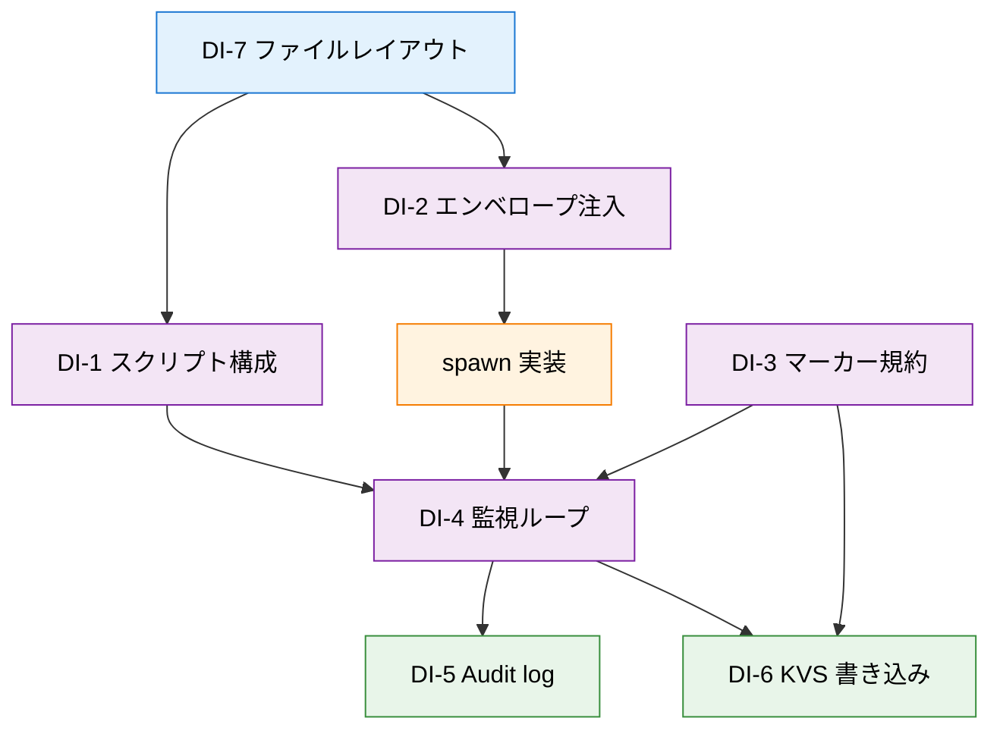

# Step 4-2: 成果物パース + 状態管理 — KickOff

> 本 KickOff は Step 4-2 [Discussion](../discussions/2026-05-14-discussion-parse-and-state-management.md) の Q1〜Q7 合意をもとに、実装スコープ・DI・依存関係・完了条件を定義する。Step 4-1（[PR #85](https://github.com/stlwolf/ai-development-hub/pull/85)）の schemas / ADR / validate-envelope.sh を前提とし、ポーリングベースの監視ループと状態管理の実装骨格を構築する。

## 背景

- [Epic #19](https://github.com/stlwolf/ai-development-hub/issues/19) Phase 4 MVP 実装の Step 4-2。Step 4-1 でエンベロープスキーマ・失敗分類・監査ログスキーマ・exit code マッピング・セッション状態 KVS スキーマ・`validate-envelope.sh` が確定済み
- Step 4-0 Discussion の 15 論点のうち、4-2 に直結する実装論点を `question-driven-design` で 7 問に絞り込み、全問合意済み（[Discussion](../discussions/2026-05-14-discussion-parse-and-state-management.md) status: closed）
- Step 4-2 の主題: **`@@OE_EXIT:{code}` マーカーの検出・パース、ポーリングベースの監視ループ、G4 6 値への分類、KVS / 監査ログへの書き込み**を Bash 関数ライブラリとして実装
- 4-1 で設計のみだった要素を実行可能なコードに落とし込むステップ

### 駆動層入力（4-1 成果物）

| 成果物 | パス | 本 Step での利用 |
|--------|------|----------------|
| Envelope Schema | `schemas/envelope.schema.json` | `lib/envelope.sh` が一時ファイル生成時に参照 |
| Failure Taxonomy | `schemas/failure-taxonomy.schema.json` | `lib/capture.sh` の 6 値判定の正本 |
| Exit Code Mapping | `schemas/exit-code-mapping.schema.json` | `lib/capture.sh` の exit code → 6 値変換ルール |
| Audit Log Schema | `schemas/audit-log.schema.json` | `lib/audit.sh` の emit フォーマット |
| Session State KVS | `schemas/session-state.schema.json` | `lib/capture.sh` の KVS 書き込みフォーマット |
| validate-envelope.sh | `scripts/validate-envelope.sh` | `lib/envelope.sh` から呼び出し |
| ADR: Cleanup Strategy | `docs/decisions/2026-05-14-decision-cleanup-strategy.md` | `lib/cleanup.sh` の設計根拠 |
| ADR: Permission Separation | `docs/decisions/2026-05-14-decision-permission-separation-mvp.md` | MVP 権限境界の前提 |
| ADR: #20 Phase Convergence | `docs/decisions/2026-05-14-decision-issue-20-phase-convergence.md` | 中間層（wez CLI）との合流方針 |

### 観測層 Issue（Read-only）

- [#19](https://github.com/stlwolf/ai-development-hub/issues/19) — Epic 親、Phase 4 ステップ管理
- [#84](https://github.com/stlwolf/ai-development-hub/issues/84) — Step 4-1 サブ Issue（closed、[PR #85](https://github.com/stlwolf/ai-development-hub/pull/85)）
- [#87](https://github.com/stlwolf/ai-development-hub/issues/87) — Step 4-2 サブ Issue（本 KickOff の観測層）

## スコープ

### 本 KickOff のスコープ

- `bin/oe` エントリポイント + `lib/` 7 ファイルの実装
- `@@OE_EXIT:{code}` マーカーの検出・パース・6 値分類
- ポーリングベースの監視ループ（2s 間隔、全ペイン巡回）
- サーキットブレーカー（1800s / 10 turns / 5 panes）
- Audit log emit（7 種 MVP）
- KVS atomic write（`{session_id}.state.json`）
- trap EXIT によるクリーンアップ（管理ペイン kill + 一時ファイル削除）

### 本 KickOff のスコープ外

- `@@OE_OUTPUT:path` マーカー（将来拡張）
- `--verbose` フラグ（`polling_snapshot` / `validation_failure` 記録）
- dashboard API / TUI 表示（4-3 以降）
- UC-2 並列協調の ownership 宣言・コンフリクト検出（4-3 以降）
- UC-3 人間俯瞰の `wez notify` 統合（4-3 以降）
- サブエージェント側への OE 固有ロジック注入（Q6 でディスパッチャ一元化を選択済み）

## Decision Items

> Discussion Q1〜Q7 を DI に変換。各 DI は質問駆動設計で合意済みのため、判断そのものは確定している。本 KickOff では実装上の具体化ポイントを付記する。

### DI-1: スクリプト構成 — 関数ライブラリ + エントリ（Q1）

- **決定**: `bin/oe` をエントリポイント、`lib/` に機能別 `.sh` を配置。`bin/oe` は `source` で `lib/` を読み込み、メイン処理を呼び出す
- **実装上の具体化**:
  - `bin/oe` の shebang: `#!/usr/bin/env bash`
  - `lib/` の各ファイルは関数定義のみ（直接実行不可、`source` 専用）
  - `LIB_DIR` は `bin/oe` からの相対パス（`$(cd "$(dirname "$0")/../lib" && pwd)`）で解決
  - 将来 C（サブコマンド CLI）へ昇格する際: `bin/oe spawn` → `lib/spawn.sh::oe_spawn()` のルーティング追加で対応

### DI-2: エンベロープ注入方式 — 一時ファイル（Q2）

- **決定**: `/tmp/oe-{session_id}-envelope.json` に書き出し、`validate-envelope.sh` で検証後、`wez pane send` でプロンプト先頭に展開注入
- **実装上の具体化**:
  - `lib/envelope.sh::oe_envelope_create()` — envelope JSON 生成 → 一時ファイル書き出し → `validate-envelope.sh` 呼び出し
  - `lib/envelope.sh::oe_envelope_inject()` — 一時ファイルから読み込み → `wez pane send` でターゲットペインに注入
  - 一時ファイルのライフサイクル: `oe_envelope_create()` で生成、`lib/cleanup.sh` で削除
  - パス規約: `/tmp/oe-{session_id}-envelope.json`（`session_id` は ULID 26 文字）

### DI-3: マーカー規約 — `@@OE_EXIT:{code}` MVP（Q3）

- **決定**: MVP は `@@OE_EXIT:{code}` のみ。プレフィックス `@@OE_` で名前空間確保。将来 `@@OE_OUTPUT:path` 追加可能
- **実装上の具体化**:
  - `lib/constants.sh` に定義: `OE_MARKER_PREFIX="@@OE_"`、`OE_EXIT_MARKER_RE='@@OE_EXIT:([0-9]+)'`
  - `lib/capture.sh::oe_capture_scan()` — `wez pane capture` の出力を正規表現でスキャンし、マーカー検出
  - 検出フロー: capture 出力 → `grep -oE "$OE_EXIT_MARKER_RE"` → exit code 抽出 → `oe_capture_classify()` で 6 値判定
  - 6 値判定ロジック（`exit-code-mapping.schema.json` 準拠）:
    - `0` → `success`
    - `1` → `partial`
    - `2` → `retryable_failure`
    - タイマー超過（CB） → `timeout`
    - マーカーなし + プロセス停止 → `protocol_error`
    - 明示ブロッカー検出 → `blocked`

### DI-4: 監視ループ構造 — 単一ループ全ペイン巡回（Q4）

- **決定**: 単一 `while` ループで全管理ペインを 2s 間隔で順次 capture。SLO 5s に余裕あり
- **実装上の具体化**:
  - `lib/monitor.sh::oe_monitor_loop()` — メインループ関数
  - ループ 1 サイクルの処理順:
    1. 管理ペインリスト取得（registry から）
    2. 各ペインに対し `oe_capture_scan()` 呼び出し
    3. 状態変化検出時: `oe_audit_emit()` で `state_change` イベント記録
    4. 完了検出時: `oe_capture_classify()` → KVS 書き込み → `session_end` イベント記録
    5. CB チェック: 経過時間 / ターン数 / ペイン数を `constants.sh` の閾値と比較
    6. CB 違反時: `circuit_breaker_triggered` emit → 管理ペイン kill → ループ終了
    7. `sleep 2`
  - ループ終了条件: 全ペイン完了 or CB 発動 or SIGINT/SIGTERM 受信

### DI-5: Audit log 範囲 — 7 種 MVP（Q5）

- **決定**: MVP は 7 イベント種別。`polling_snapshot` / `validation_failure` は `--verbose` 拡張へ先送り
- **実装上の具体化**:
  - `lib/audit.sh::oe_audit_emit()` — JSONL 1 行を `audit/{session_id}.jsonl` に追記
  - フォーマット: `audit-log.schema.json` 準拠（`ts / session_id / pane_id / event_type / state / payload`）
  - `ts` は `date -u +"%Y-%m-%dT%H:%M:%S+00:00"` で UTC 固定
  - 各 emit 呼び出し元:
    - `session_start`: `lib/spawn.sh`（envelope 注入完了後）
    - `state_change`: `lib/monitor.sh`（マーカー検出時）
    - `interrupt`: `lib/monitor.sh`（SIGINT / TTY inject 実行時）
    - `human_input`: `lib/monitor.sh`（人間入力検出時、UC-3）
    - `circuit_breaker_triggered`: `lib/monitor.sh`（CB 発動時）
    - `cleanup`: `lib/cleanup.sh`（trap ハンドラ実行時）
    - `session_end`: `lib/monitor.sh`（ペイン完了・最終状態確定時）

### DI-6: KVS 書き込み責務 — ディスパッチャ側一元化（Q6）

- **決定**: ディスパッチャ（`capture.sh`）が exit code + マーカーから判定し、KVS を書き込む。サブエージェント側に書き込みを要求しない
- **実装上の具体化**:
  - `lib/capture.sh::oe_capture_write_kvs()` — `session-state.schema.json` 準拠の JSON を atomic write
  - Atomic write: `jq` で JSON 生成 → `/tmp/oe-{session_id}-state.tmp` に書き出し → `mv` で `{kvs_dir}/{session_id}.state.json` に rename（POSIX mv は atomic）
  - 書き込みタイミング: `@@OE_EXIT:{code}` マーカー検出後、6 値分類完了時に 1 回だけ書き込み
  - KVS ディレクトリ: `state/`（`bin/oe` 起動時に `mkdir -p` で確保）
  - 書き込み内容: `session_id`, `pane_id`, `state`（6 値）, `last_updated`（ISO 8601）, `outputs[]`（空配列、`@@OE_OUTPUT` 未実装のため）, `blockers[]`（`blocked` 時のみ非空）

### DI-7: ファイルレイアウト — `bin/oe` + `lib/` 7 ファイル（Q7）

- **決定**: Q1 を具現化した 8 ファイル構成。既存の `scripts/validate-envelope.sh` と `schemas/` は変更せず参照のみ
- **実装上の具体化**:

```
projects/orchestration-engine/
├── bin/
│   └── oe                    # エントリポイント（source lib/*.sh → main 呼び出し）
├── lib/
│   ├── constants.sh          # @@OE_ プレフィックス、SLO 5s、CB 閾値、KVS/audit パス
│   ├── envelope.sh           # oe_envelope_create / oe_envelope_inject
│   ├── spawn.sh              # oe_spawn（wez pane split + send + session_start emit）
│   ├── capture.sh            # oe_capture_scan / oe_capture_classify / oe_capture_write_kvs
│   ├── monitor.sh            # oe_monitor_loop（2s poll + CB + audit 統合）
│   ├── audit.sh              # oe_audit_emit（JSONL 追記）
│   └── cleanup.sh            # oe_cleanup（trap handler: pane kill + /tmp 削除）
├── state/                    # KVS 出力先（{session_id}.state.json）
├── audit/                    # 監査ログ出力先（{session_id}.jsonl）
├── scripts/
│   └── validate-envelope.sh  # 既存（4-1 成果物、変更なし）
└── schemas/                  # 既存（4-1 成果物、変更なし）
```

- 命名規約: 関数名は `oe_` プレフィックス（C 昇格時のネームスペース準備）
- `state/` と `audit/` は `bin/oe` 起動時に `mkdir -p` で自動作成

## DI 依存関係

> Q1〜Q7 の合意から導出した実装依存関係。Plan のフェーズ順序決定の根拠となる。



凡例:

- 矢印 `-->`: 実装依存（A の完了が B の前提）
- 色分け: 基盤（青）/ コア（紫）/ 出力（緑）/ 実装中間（橙）

主要依存（Plan 着手前に念頭に置くべきもの）:

- `DI-7 → DI-1`: ファイルレイアウト確定が全 `lib/` 実装の前提
- `DI-3 → DI-4 → DI-5/DI-6`: マーカー規約 → 監視ループ → 出力（audit / KVS）の直列パス
- `DI-2 → spawn → DI-4`: envelope 注入 → サブ起動 → 監視ループ開始の直列パス
- `DI-5 / DI-6` は並行実装可能（ともに DI-4 の出力を受ける）

推奨実装順:

1. **Phase A（基盤）**: DI-7 + DI-1（`constants.sh` + `bin/oe` スケルトン）
2. **Phase B（入力）**: DI-2 + DI-3（`envelope.sh` + マーカー定義 → `spawn.sh`）
3. **Phase C（コア）**: DI-4（`monitor.sh` + `capture.sh`）
4. **Phase D（出力）**: DI-5 + DI-6（`audit.sh` + KVS 書き込み）+ `cleanup.sh`
5. **Phase E（統合）**: `bin/oe` メインフロー結線 + shellcheck

## Open Questions

### 実装中に判断する事項

- `@@OE_EXIT:{code}` の具体フォーマット: 改行位置、前後の区切り文字（`capture.sh` の正規表現設計時に確定）
- `audit/` と `state/` のベースディレクトリ: `bin/oe` の CWD 相対 vs 環境変数 `OE_DATA_DIR` 指定（Phase A で確定）
- `wez pane capture` の `--lines` オプション値: 末尾何行をスキャンするか（Phase C で実測して確定）
- `blocked` 状態の判定ヒューリスティクス: マーカーなし + プロセス存在 + 出力停止の組み合わせ条件（Phase C で確定）

### Step 4-2 スコープ外だが次ステップに影響する事項

- `--verbose` フラグ: `polling_snapshot` / `validation_failure` の記録制御。4-3 以降のスコープ
- UC-2 並列協調の ownership 宣言: `session-state.schema.json` への `ownership` フィールド追加。4-3 以降
- UC-3 `wez notify` 統合: `human_input` 検出時の自動通知。4-3 以降

## 依存・参照

### 直接依存

- Step 4-1 成果物（[PR #85](https://github.com/stlwolf/ai-development-hub/pull/85)）:
  - `schemas/envelope.schema.json` — envelope 構造の正本
  - `schemas/failure-taxonomy.schema.json` — 6 値分類の正本
  - `schemas/exit-code-mapping.schema.json` — exit code マッピングの正本
  - `schemas/audit-log.schema.json` — 監査ログフォーマットの正本
  - `schemas/session-state.schema.json` — KVS フォーマットの正本
  - `scripts/validate-envelope.sh` — envelope バリデーション（`lib/envelope.sh` から呼び出し）
  - `docs/decisions/2026-05-14-decision-cleanup-strategy.md` — クリーンアップ設計根拠
- Step 4-2 Discussion: [`2026-05-14-discussion-parse-and-state-management.md`](../discussions/2026-05-14-discussion-parse-and-state-management.md)
- [#20](https://github.com/stlwolf/ai-development-hub/issues/20) Phase 1（wez CLI）完了済み — `wez pane capture / split / send / kill` API の前提

### 観測層 Issue（Read-only）

- [#19](https://github.com/stlwolf/ai-development-hub/issues/19) — Epic 親、Phase 4 ステップ管理
- [#84](https://github.com/stlwolf/ai-development-hub/issues/84) — Step 4-1 サブ Issue（closed）
- [#87](https://github.com/stlwolf/ai-development-hub/issues/87) — Step 4-2 サブ Issue（本 KickOff の観測層）

### 並行・合流候補

- [#20](https://github.com/stlwolf/ai-development-hub/issues/20) Phase 3（中間層プロトコル）— 4-2 後に着手。本 Step の `wez pane capture` 利用実績が Phase 3 のプロトコル設計入力になる

## 完了条件

> 本 KickOff の成果物（`bin/oe` + `lib/` 7 ファイル）が以下を満たした時点で完了とする。

- [ ] `bin/oe` が envelope を受け取りサブエージェントを spawn できる
  - `lib/envelope.sh` が `/tmp/oe-{session_id}-envelope.json` を生成し `validate-envelope.sh` で検証 pass
  - `lib/spawn.sh` が `wez pane split` + `wez pane send` でサブエージェントを起動
  - `lib/audit.sh` が `session_start` イベントを emit
- [ ] `@@OE_EXIT:{code}` マーカーで終了を検出し 6 値に分類できる
  - `lib/capture.sh` が `wez pane capture` 出力からマーカーを正規表現でスキャン
  - exit code → `failure-taxonomy.schema.json` の 6 値へ正しく分類
- [ ] ポーリングループが 2s 間隔で全管理ペインを巡回する
  - `lib/monitor.sh` が単一 `while` ループで管理ペインリストを順次処理
  - SLO 5s 以内に状態変化を検知（5 ペイン巡回で約 380ms + 2s sleep）
- [ ] CB（1800s / 10 turns / 5 panes）違反時に `circuit_breaker_triggered` を emit して停止する
  - `lib/monitor.sh` がループ内で経過時間 / ターン数 / ペイン数を `constants.sh` 閾値と比較
  - 違反検出時: `oe_audit_emit circuit_breaker_triggered` → 管理ペイン kill → ループ終了
- [ ] KVS（`{session_id}.state.json`）に完了状態を atomic write する
  - `lib/capture.sh` が `session-state.schema.json` 準拠の JSON を生成
  - `/tmp/` への書き出し → `mv` による atomic rename で `state/` に配置
- [ ] Audit log に 7 種のイベントを JSONL で出力する
  - `audit-log.schema.json` 準拠の各フィールド（`ts / session_id / pane_id / event_type / state / payload`）
  - 7 種: `session_start / state_change / interrupt / human_input / circuit_breaker_triggered / cleanup / session_end`
- [ ] trap EXIT で管理ペイン kill + 一時ファイル削除が動作する
  - `lib/cleanup.sh` が `trap oe_cleanup EXIT INT TERM` を設定
  - 管理下ペインの `wez pane kill` + `/tmp/oe-{session_id}-*` の削除
  - `cleanup` イベントを audit log に記録
- [ ] shellcheck で全スクリプトが pass する
  - `bin/oe` + `lib/*.sh`（7 ファイル）で `shellcheck` エラーゼロ

## 次アクション

> 本 KickOff を起点に、`kickoff-to-plan` で Plan に展開する。

- Phase A〜E の実装順に沿って TODO 化（§DI 依存関係の推奨実装順参照）
- 各 Phase に対し「実装 → shellcheck → 単体動作確認 → Episode 記録」のサイクルを配置
- 4-2 用の観測層サブ Issue を作成し、KickOff と相互リンク
- Plan 着手前に `@@OE_EXIT:{code}` の具体フォーマット（改行・区切り）を Phase B 冒頭で確定

## 関連

- Parent Epic: [#19](https://github.com/stlwolf/ai-development-hub/issues/19)
- Step 4-1 成果物: [PR #85](https://github.com/stlwolf/ai-development-hub/pull/85)（[#84](https://github.com/stlwolf/ai-development-hub/issues/84) closed）
- Step 4-2 Discussion: [`2026-05-14-discussion-parse-and-state-management.md`](../discussions/2026-05-14-discussion-parse-and-state-management.md)
- Step 4-0 Discussion: [`2026-05-13-discussion-engine-scope-and-goals.md`](../discussions/2026-05-13-discussion-engine-scope-and-goals.md)
- Step 4-1 KickOff: [`2026-05-13-kickoff-step-4-1-envelope-and-dispatcher.md`](./2026-05-13-kickoff-step-4-1-envelope-and-dispatcher.md)
- wez CLI（Phase 1 完了）: [#20](https://github.com/stlwolf/ai-development-hub/issues/20)
